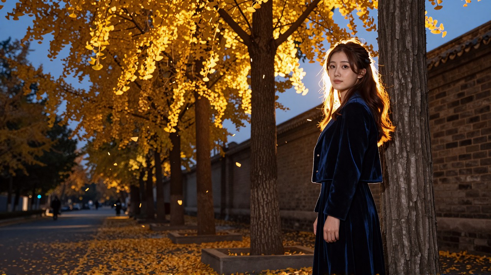
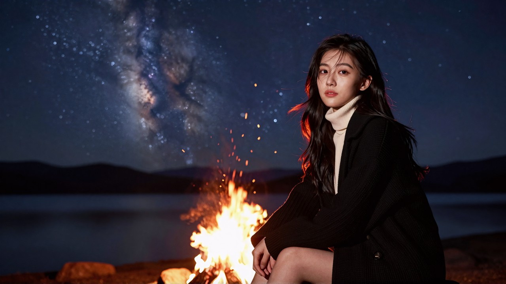
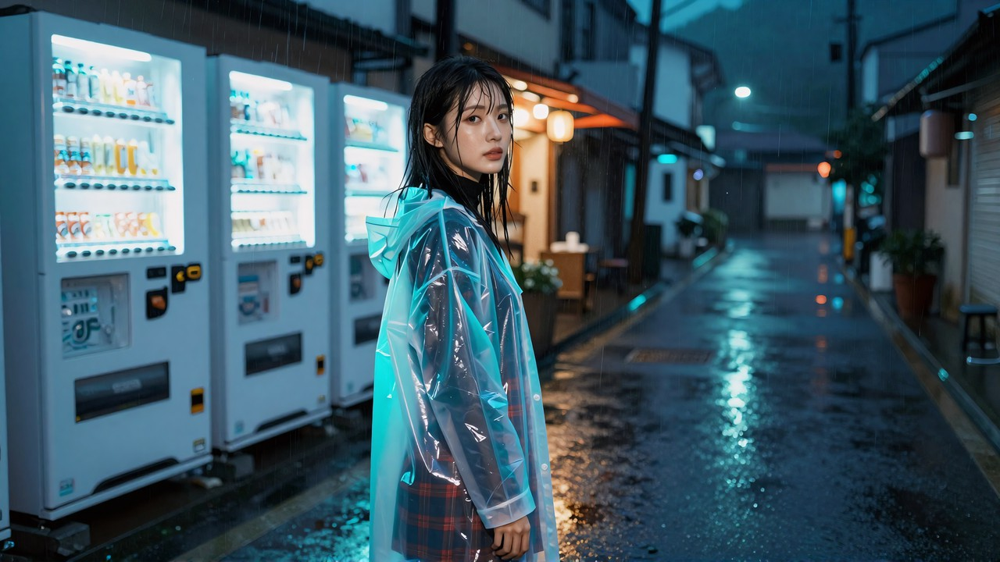
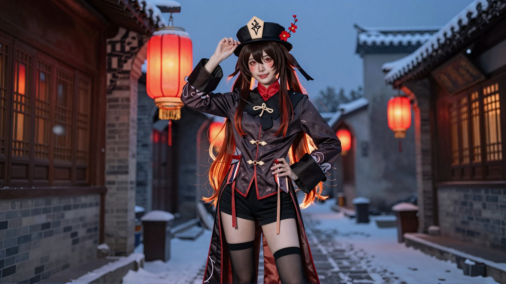
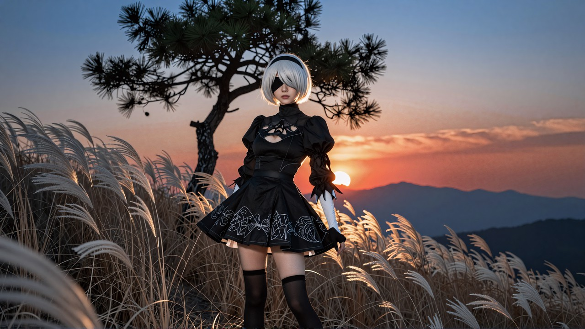
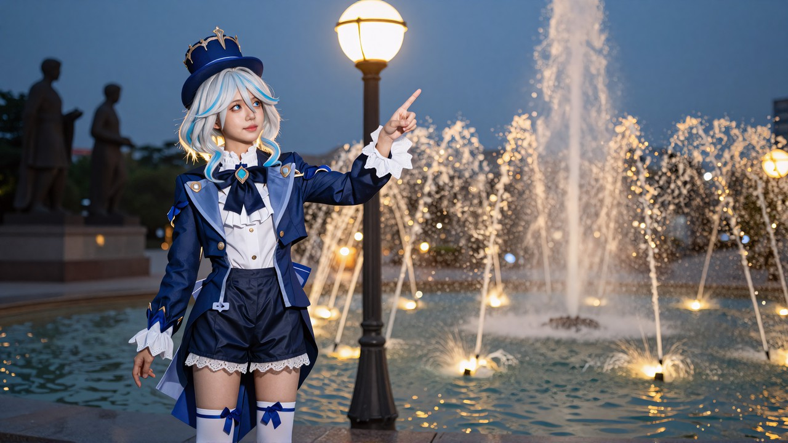

# ai-portrait-light

**给任何文生图模型写人像光线提示词的方法论。**
~200 张同种子单变量对照打出来的，装成一个 Claude Code / Claude Desktop 的 skill。

> *A model-agnostic methodology for writing portrait-lighting prompts, derived from
> ~200 single-variable A/B renders. Prompts are full-sentence Chinese — they work as-is
> in Doubao / Jimeng / Qwen as well as local ComfyUI. English summary: [README.en.md](README.en.md)*

一句话版：

> **别写「唯美的逆光」，去写「太阳低低地卡在她身后两栋楼之间的缝里、和她的头一样高」。**

其余所有规矩都是这一句的推论。

---



| | |
|---|---|
|  |  |
|  |  |
|  |  |
|  |  |

十张成品各自的完整提示词在 [`docs/配方全文.md`](docs/配方全文.md)，可以直接复制。

---

## 装

```bash
git clone https://github.com/L-Trunks/ai-portrait-light.git
cd ai-portrait-light
bash install.sh            # Windows: powershell -ExecutionPolicy Bypass -File install.ps1
```

装到 `~/.claude/skills/`，之后跟 Claude Code 说一句「帮我写个逆光人像的提示词」就会触发。
加 `--project` 则只装到当前项目。

**不用 Claude 也能用** —— 直接读 [`skills/portrait-light/SKILL.md`](skills/portrait-light/SKILL.md)，
它本身就是一份可以照着抄的方法论文档。提示词是纯中文整段，不用拆词、不用配负向。

## 里面有什么

| 文件 | 内容 |
|---|---|
| [`skills/portrait-light/SKILL.md`](skills/portrait-light/SKILL.md) | 方法论本体：六条通用规律、三种构图族、光源怎么钉、模型相关的部分、验收陷阱 |
| [`docs/配方全文.md`](docs/配方全文.md) | 十张成品的完整提示词，直接可抄 |
| [`docs/对照实验.md`](docs/对照实验.md) | 逐轮怎么打的、每轮推翻了什么、度量脚本 |
| `assets/` | 十张成品 |

## 这份是方法论，不是某个模型的参数表

规律按「换模型还成不成立」分成两半，SKILL.md 里是分开写的：

- **换模型也成立**（构图和光学层面）：光靠场景写、空气要有介质、光源的距离和方位、
  灯具名词自带高度、补色对、构图比光更强、三种构图族各自的写法。
- **换模型要重验**（和采样器 / 条件机制绑定）：cfg=1 的负向失效、字数与景别的关系、
  seed 的可复现性。

证据是在本地 ComfyUI + z-image 上打的，但**除了上面第二类，其余都不依赖这个模型**。

## ⭐ 最贵的一条：光对了 ≠ 好看，这是**两道独立的关**

一组十张环境人像里，有三张的边光、贴身光源、补色对**全部成立**，照样一张没留下。
把活下来那张和被毙的九张并排比，差的不是光，是画面：

| | 活下来那张 | 被毙的九张 |
|---|---|---|
| 有没有**一大片东西自己在发光** | 整面被夕阳照透的紫藤，占 1/3 画幅 | 松枝 / 藤蔓叶是**不透光实体块**；霓虹 / 窗灯 / 银河**在几百米外** |
| 补色的**冷那一半** | 饱和紫，占 1/3 画幅 | 只有一条淡蓝棉布裙 → 整张仍读成全暖 |
| 有没有**一块真正的黑** | 黑立柱 + 黑和服 | 全是柔灰中间调，没有暗部锚点 |
| 服装 | 蝶羽羽织 | **四张都是奶白毛衣 + 牛仔裤**，同一件连出四张 |

判据全在 [`SKILL.md` §3.4](skills/portrait-light/SKILL.md)。
⛔ **黑锚要挂在场景里，不能指望衣服** —— 戏服由角色 / LoRA 决定，写好的黑制服会出成白裙。

## 四条最贵的结论

**① 光是靠场景写出来的，不是靠形容词。**
五档强度的光线形容词堆在句尾，三项指标纹丝不动；
只把场景句从「身后是干净的暖白色墙面」换成「身后是敞开的店门和门外的街道」，逆光一次就出来。
因为墙把太阳挡在画框外了 —— **要把场景写成物理上只能这么打光。**

**② 光源的距离和方位都要钉死。**
「整片城市霓虹就在她身后」——霓虹在几百米外，落到人身上的光约等于零，出来是**好看的背景板**。
「和她的头一样高」只锁了高度，太阳照样会飘到侧后方去，得补一句「正好在她的头的正后方」。
⛔ 还有几条反直觉的，都是「**名词自带的语义压得过形容词**」的变体：

- **灯具名词自带高度**：写「路灯，灯头和她的头一样高」，模型按路灯的常识把灯架到她正上方；
  写「霓虹灯箱招牌，比她高出一头」，它被挂到二楼外墙上。
  ⭐ 修法不是加形容词，是换一个**本来就在那个高度**的发光体（自动贩卖机 / 矮墙上的马灯 / 挂着的灯笼）。
- **量词也是位置信息**：「一*串*红灯笼挂在她身后」会被理解成街道两边成排的灯笼，光源跑到两侧去。
  要定点光源就用单数，⭐ 单数还不够就**再给它一个画面里的尺寸**（「占画面高度的四分之一」）。
- **时间词决定太阳这个实体在不在画面里**：「黄昏 / 傍晚」只交代天色，
  开阔场景里出来是日落**之后**的余晖天，太阳早没了；写「**日落**」+「太阳是一个明晃晃的圆盘」才有。
- **支架要比她高**：齐胸的花穗、芦苇、麦浪托不住太阳 ——
  ⭐ 开阔地里太阳的高度由**地平线**决定，形容词压不过它，得给一个比她高、且画出来的实体
  （树 / 花架 / 建筑 / 风车）。且这个实体要在两米内，几十米外的石雕等于没有。

⚠️ 而「正后方」这条只对能透光的浅色主体成立；一身黑的角色钉正后方会变成剪影，
得让光源偏一侧、再逐条点名亮线落在哪几条边上。

**③ 每张给一组补色对。**
光已经对了但画面还是平，九成是因为整张图只有一个色温。
暖橘钠灯 ↔ 冷蓝雪夜、火橘 ↔ 夜蓝、蓝紫射灯 ↔ 暖橘荧光棒、冷蓝银河 ↔ 暖黄营灯。

**④ cfg=1 时没有「不要」。**（模型相关：所有开了 Lightning / turbo / 蒸馏的模型）
负向提示词形同虚设，填了不报错、只是不生效。所有禁止项必须**正向化写成肯定句**：

| 想要 | ⛔ 写不出来 | ✅ 正着写 |
|---|---|---|
| 不要投影 | 负向填 `shadow` | 每个物体都直接贴在白纸上，不产生任何投影 |
| 脸别太圆 | 「脸不胖」 | 窄长的鹅蛋小脸，脸颊平顺内收、下颌角收窄，下巴是尖的 |
| 短裙别变连体衣 | 「不是连体衣」 | 裙筒是完整闭合的一圈、四周一样齐地把大腿包住 |

规律叫「可选结构改成不可选」：**`没有X` 是在召唤 X。**

## 三种构图族，规律互相矛盾

最容易翻车的地方 —— 很多人把「发丝光」的写法套到全身照上，怎么写都不出来。

| | 特写 | 近景 / 半身 | 环境人像（横幅）|
|---|---|---|---|
| 靠什么成立 | 暗部托脸 + 贴脸的光源 | 构图（人偏一侧 + 背景全糊）| 场景几何 + **贴身**主光 |
| 背景 | 正向写死「糊成一片没有细节」 | 同左 | 反过来：**要有细节** |
| 画幅 | ⛔ 只能竖幅 | 都行 | ⛔ 只能横幅 |
| 最容易废在 | 画框收不住，退成胸像 | 背景抢戏 | 退化成「好看的背景板」|

⛔ **横幅压不住特写**：同一句特写相机在 16:9 下连改三版、十二张出图景别一寸没动；
换成竖幅一次到位。16:9 的画框本身就在要求横向填充。

## ⚠️ 两条免责

**数值全对也可能是废片。** 这套里有八个量化指标，但它们只能证伪不能证真 ——
数值最漂亮的那组是「人身上一点光都没有的好看背景板」，这条踩过三次。
**唯一可靠的验收是肉眼看：发丝有没有一根根亮起来、人身上有没有轮廓光。**

**挑片比改措辞收敛快。** 同提示词换种子的摆幅，比绝大多数措辞改动都大 ——
这十张是 30 张候选里挑的，**十个位置全部换掉了默认那张**。
同一个方向改过三次还没动，说明卡的是构图或画幅这类结构性的东西，该换概念了。

## 许可

方法论文档与图片 CC BY 4.0，代码 MIT。详见 [LICENSE](LICENSE)。
图中的 cosplay 角色版权归各自权利人所有，本仓库与其无关联。

相关：[ai-film-skills](https://github.com/L-Trunks/ai-film-skills) —— 同一个人的 AI 短片方法论 skill 集。
