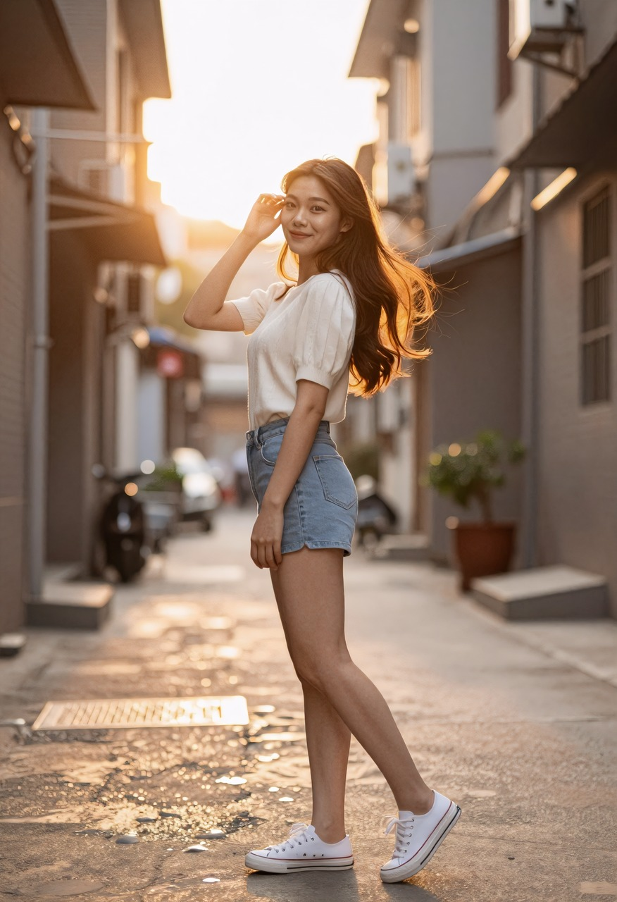
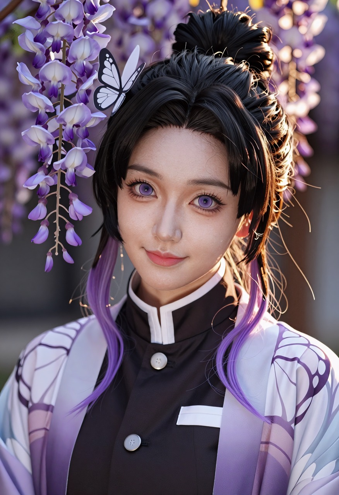
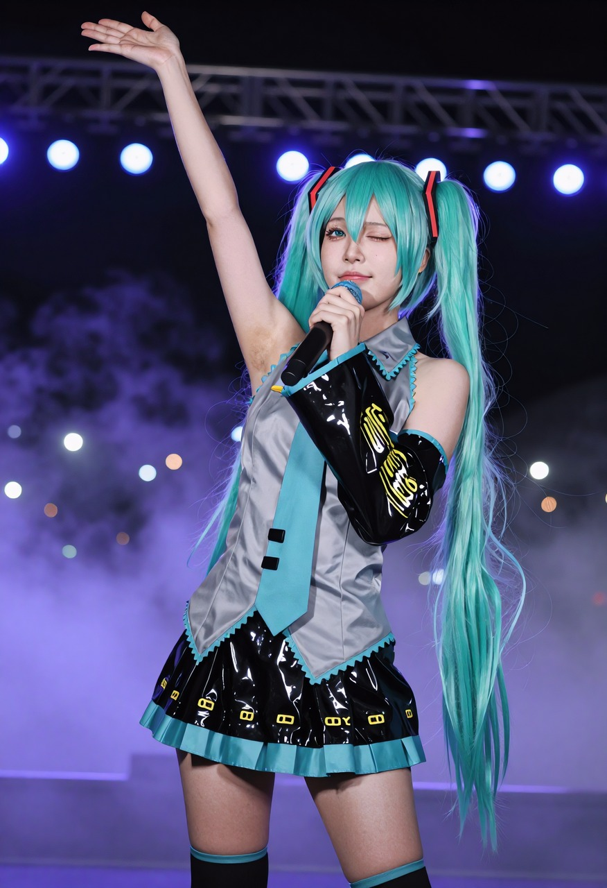
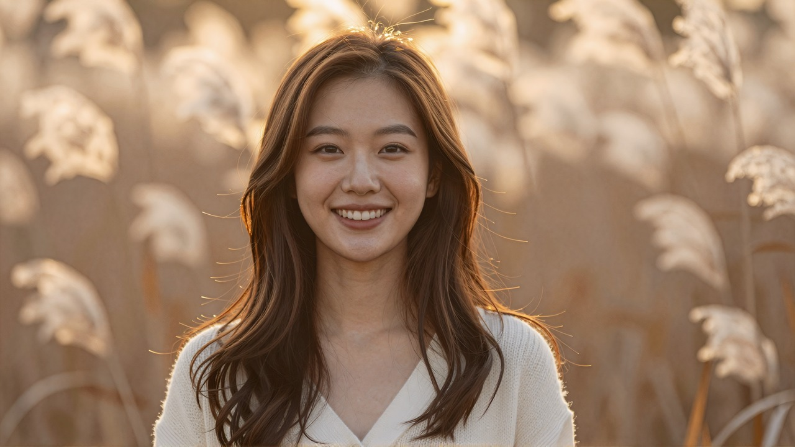
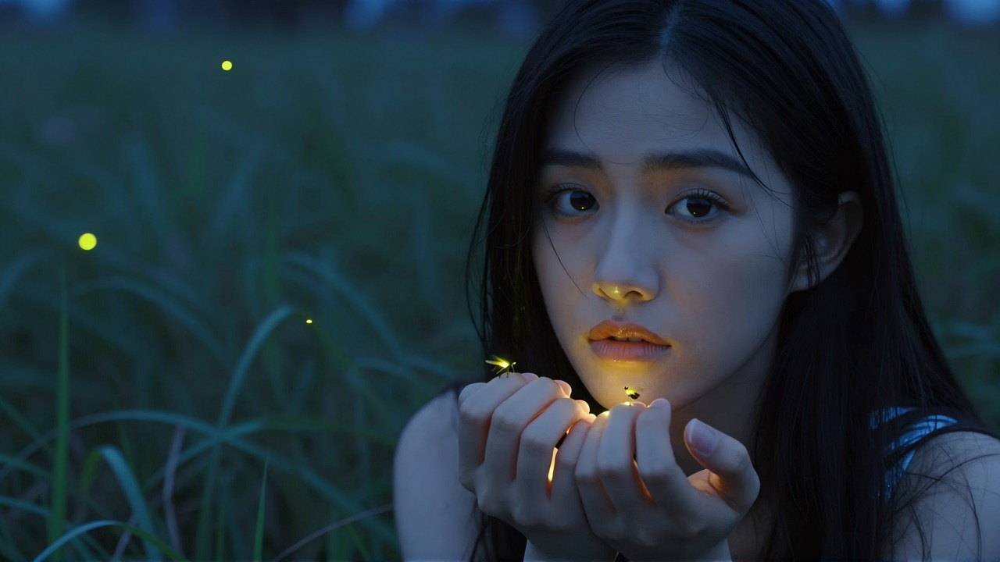
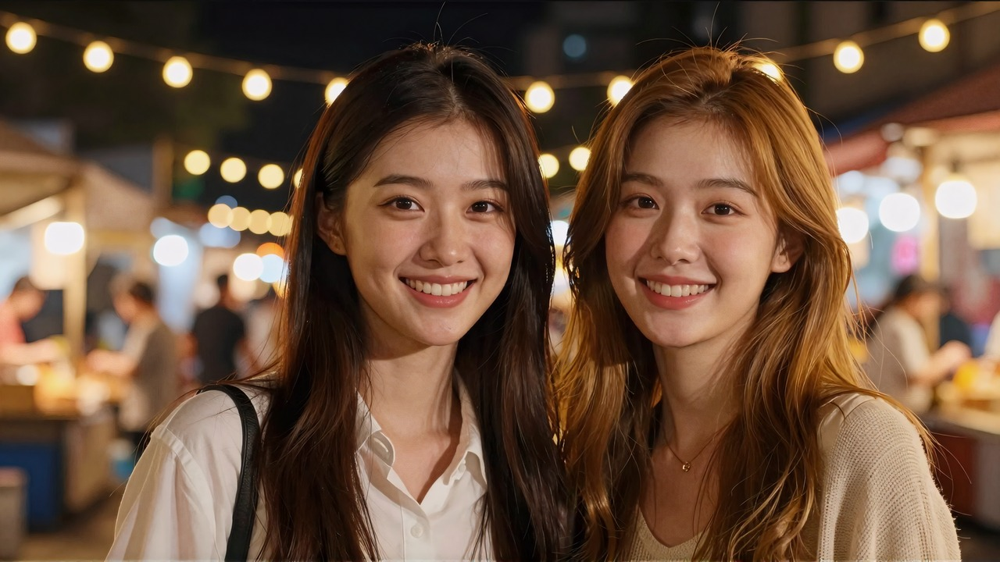
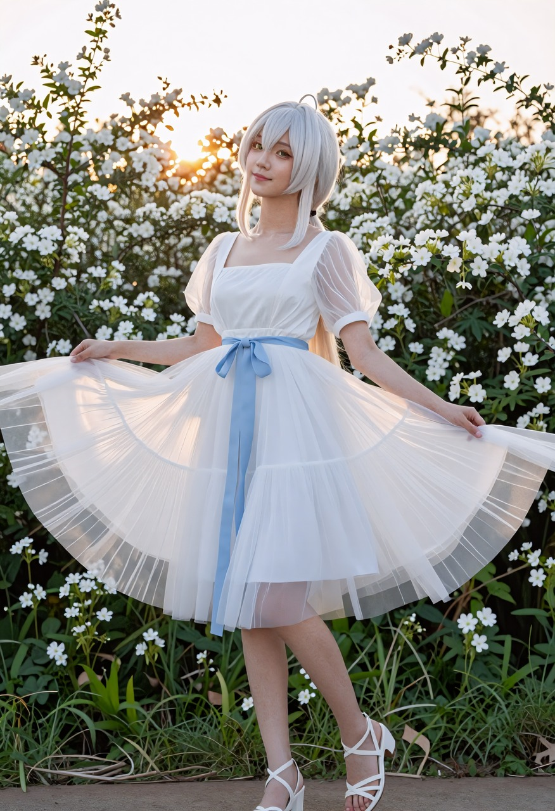
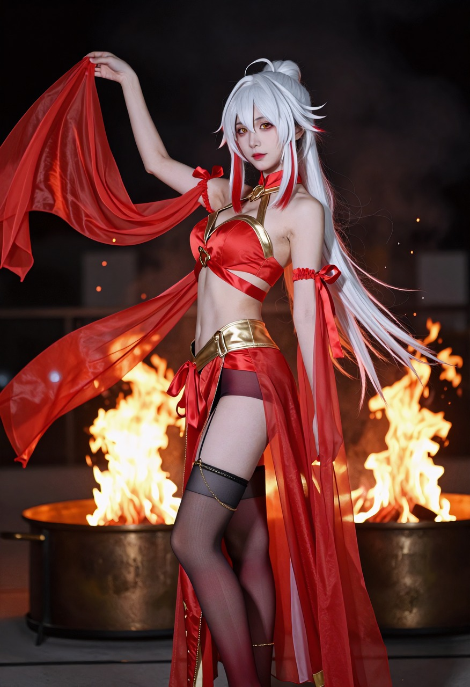

# zimage-portrait-light

**给 z-image（以及一切 cfg=1 的加速模型）写人像光线提示词的配方。**
十五轮 ~120 张同种子单变量对照打出来的，装成一个 Claude Code / Claude Desktop 的 skill。

> *A Chinese-prompt lighting recipe for portrait image generation on cfg=1 models
> (z-image / Lightning / turbo / S2V). Derived from ~120 single-variable A/B renders.
> English summary: [README.en.md](README.en.md)*

一句话版：

> **别写「唯美的逆光」，去写「太阳低低地卡在她身后两栋楼之间的缝里、和她的头一样高」。**

其余所有规矩都是这一句的推论。

---



| | |
|---|---|
|  |  |
|  |  |
|  |  |
|  |  |

十张成品各自的完整提示词在 [`docs/配方全文.md`](docs/配方全文.md)，可以直接复制。

---

## 装

```bash
git clone https://github.com/L-Trunks/zimage-portrait-light.git
cd zimage-portrait-light
bash install.sh            # Windows: powershell -ExecutionPolicy Bypass -File install.ps1
```

装到 `~/.claude/skills/`，之后跟 Claude Code 说一句「帮我写个逆光人像的提示词」就会触发。
加 `--project` 则只装到当前项目。

**不用 Claude 也能用** —— 直接读 [`skills/zimage-portrait-light/SKILL.md`](skills/zimage-portrait-light/SKILL.md)，
它本身就是一份可以照着抄的配方文档。提示词是纯中文整段，粘到豆包 / 即梦 / 通义里同样成立。

## 里面有什么

| 文件 | 内容 |
|---|---|
| [`skills/zimage-portrait-light/SKILL.md`](skills/zimage-portrait-light/SKILL.md) | 配方本体：四个档、五条硬结论、cfg=1 的写法铁律、量化验收的五个陷阱 |
| [`docs/配方全文.md`](docs/配方全文.md) | 可复制的句子模块 + 十张成品的完整提示词 |
| [`docs/对照实验.md`](docs/对照实验.md) | 十五轮怎么打的、每轮推翻了什么、度量脚本 |
| `assets/` | 十张成品 |

## 三条最贵的结论

**① 光是靠场景写出来的，不是靠形容词。**
五档强度的光线形容词堆在句尾，P1 / dB / HALO 三项纹丝不动；
只把场景句从「身后是干净的暖白色墙面」换成「身后是敞开的店门和门外的街道」，逆光一次就出来。
因为墙把太阳挡在画框外了 —— **要把场景写成物理上只能这么打光。**

**② 空气里必须有被照亮的东西。**
只写「金色时刻」，暖冷分离是 −10.11（等于没有）；加一句「空气里浮着被照亮的细小尘埃」→ +1.37。
尘 / 絮 / 雾 / 雪粒 / 花瓣 / 火星 / 干冰烟都行，跟着场景走。

**③ cfg=1 时没有「不要」。**
负向提示词形同虚设，填了不报错、只是不生效。所有禁止项必须**正向化写成肯定句**：

| 想要 | ⛔ 写不出来 | ✅ 正着写 |
|---|---|---|
| 不要投影 | 负向填 `shadow` | 每个物体都直接贴在白纸上，不产生任何投影 |
| 脸别太圆 | 「脸不胖」 | 窄长的鹅蛋小脸，脸颊平顺内收、下颌角收窄，下巴是尖的 |
| 短裙别变连体衣 | 「不是连体衣」 | 裙筒是完整闭合的一圈、四周一样齐地把大腿包住 |

规律叫「可选结构改成不可选」：**`没有X` 是在召唤 X。**

## 四个档，规律互相矛盾

最容易翻车的地方 —— 很多人把「发丝光」的写法套到全身照上，怎么写都不出来。

| | 暖金逆光·全身 | 侧脸发丝·近景 | 正脸环光·近景 | 自发光特写 |
|---|---|---|---|---|
| 靠什么成立 | 场景几何 | 构图（侧脸 + 近景） | 光的写法（环光 / 斜后光） | 一个自发光小物件 + 压暗 |
| 色调 | 暖 | 暖 | 暖 | **冷，且冷是命根子** |

口诀：**全身看场景几何，近景看构图和光的写法，冷调只走自发光档。**

## ⚠️ 一条免责

**数值全对也可能是废片。** 这套里有八个量化指标，但它们只能证伪不能证真 ——
数值最漂亮的那组是「人身上一点光都没有的好看背景板」，这条踩过三次。
**唯一可靠的验收是肉眼看发丝有没有一根根亮起来。**

## 许可

配方文档与图片 CC BY 4.0，代码 MIT。详见 [LICENSE](LICENSE)。

相关：[ai-film-skills](https://github.com/L-Trunks/ai-film-skills) —— 同一个人的 AI 短片方法论 skill 集。
