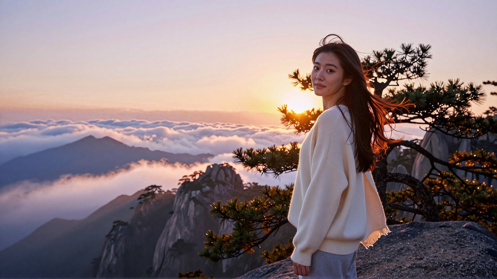
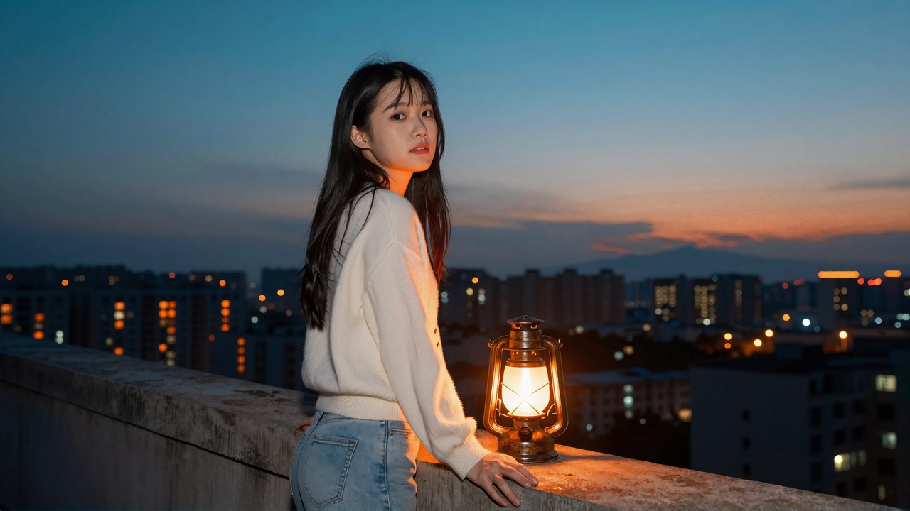
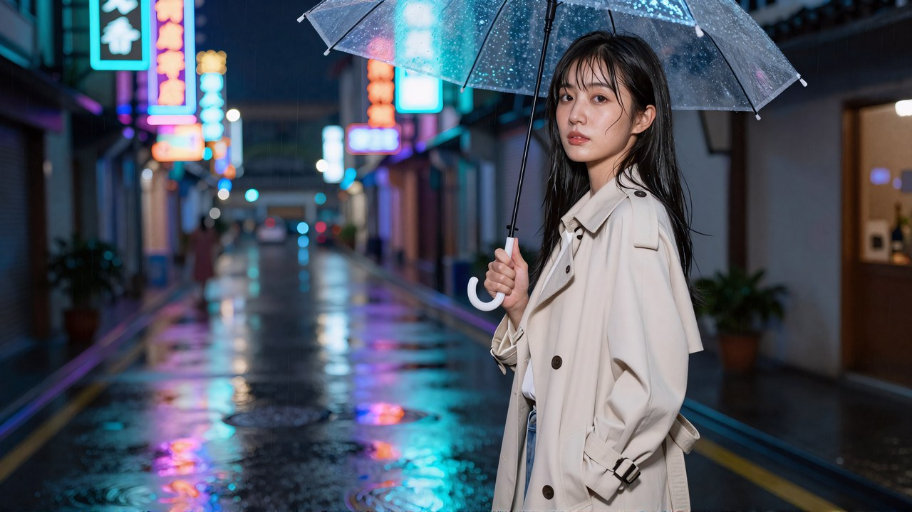
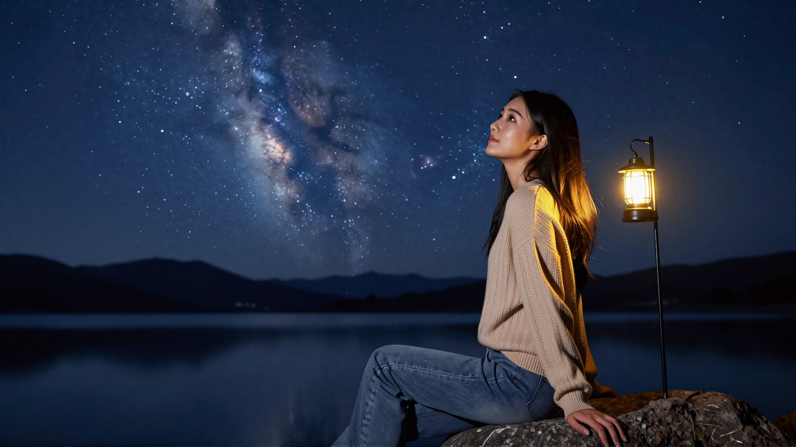
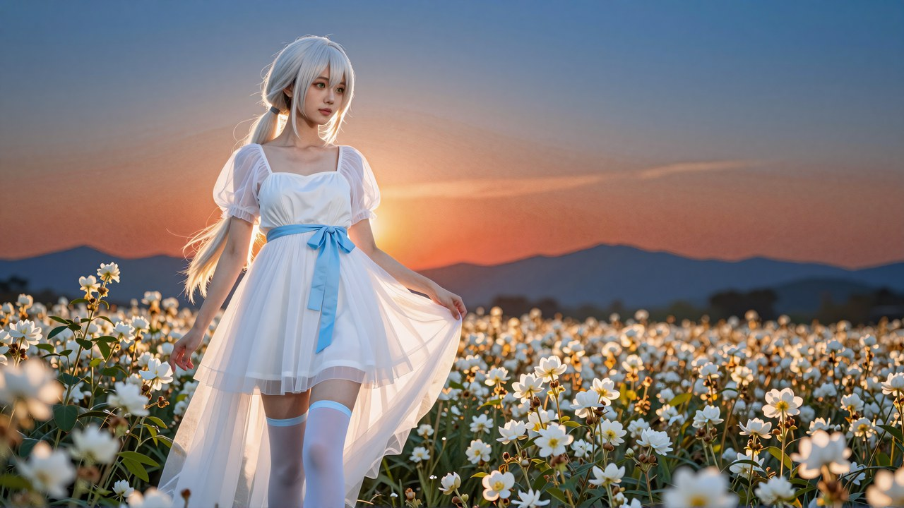
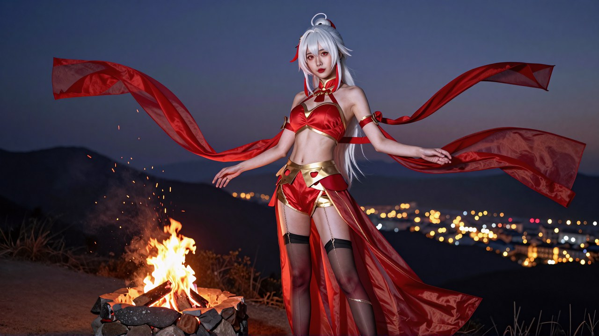
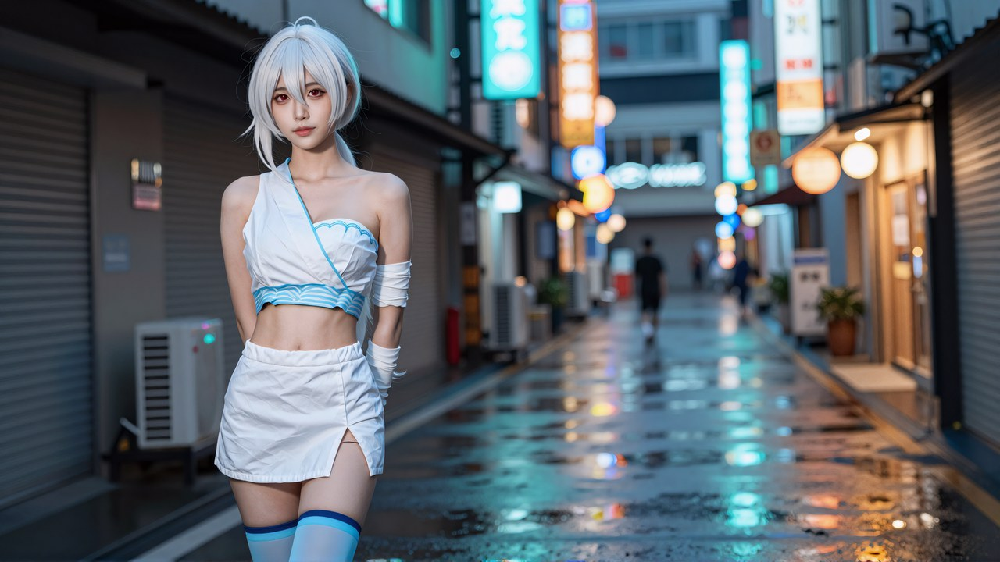

# 十张成品的完整提示词

> 全部是**纯中文整段**，直接粘进出图框就行 —— 不用拆词、不用配负向。
> 写真那五张不挂 LoRA，cos 那五张挂了一个日系街拍写实 LoRA（0.7 强度）。
> 十张都是 16:9 横幅、**环境人像**构图：人占画面高度三分之二放在三分之一处，
> 另外三分之二让给风景；光线时刻覆盖 日出 / 夕阳 / 蓝调 / 夜霓虹 四路。
>
> 规律和为什么这么写在 `../skills/portrait-light/SKILL.md`，
> 逐轮对照数据在 `对照实验.md`。
>
> ⚠️ 换种子的摆幅比换措辞大得多。这十张是 30 张候选里挑的，**十个位置全部换掉了默认那张**。
> 直接抄这些字得到的未必是同一张，多抽几个种子再挑。

---

## 01_写真_日出山脊云海

**日出 · 山脊云海 —— 补色 暖金日出 ↔ 冷蓝残夜**



488 字 · 1664x936

```
一张 16:9 横幅的真实照片。她站在画面右边三分之一处、从膝盖往上入镜，身高占满画面高度的三分之二，左边三分之二整个让给风景。一位二十出头的亚洲年轻女性，鹅蛋脸小脸，眼距略宽的清澈杏眼、双眼皮褶较窄，眉毛平直偏细，鼻梁直挺、鼻头小巧，下颌线清晰，长相很甜很出挑。她化着干净的裸妆，皮肤是细腻均匀的哑光质地。深栗色的长发被山风整片吹向一侧，几缕碎发从发顶飞起来。她穿着米白色的宽松针织衫和浅灰色的长裤，肩上松松搭着一条薄毯。她侧身站在山脊的一块大岩石上，回过头看向镜头，笑得很轻。日出刚开始的高山上，她身后半米有一棵被风吹弯的矮松，太阳正好在她的头的正后方、从两根松枝之间跳出来、和她的头一样高、正对着镜头。画面左边三分之二是一整片铺到天边的云海，被日出染成橘金色和粉紫色，云层一道一道翻涌着，更远处几座青蓝色的山尖露在云海上面。空气里浮着被照亮的晨雾，她外圈飞起来的碎发被这道光一根一根照透、亮成暖橘色的细线，肩线和手臂外缘都镶着一条暖金色的亮边。整张照片分成两半：日出那一侧是暖金色的，还没醒的天和山影是冷蓝色的。真实照片。画面里只有她一个人，双手五指完整，没有文字水印。
```

---

## 02_写真_夕阳芦苇荡

**夕阳 · 芦苇荡 —— 补色 暖金芦苇 ↔ 雾蓝长裙**


417 字 · 1664x936

```
一张 16:9 横幅的真实照片。她站在画面右边三分之一处、从膝盖往上入镜，身高占满画面高度的三分之二，左边三分之二整个让给风景。一位二十出头的亚洲年轻女性，鹅蛋脸小脸，眼距略宽的清澈杏眼、双眼皮褶较窄，眉毛平直偏细，鼻梁直挺、鼻头小巧，下颌线清晰，长相很甜很出挑。她化着干净的裸妆，皮肤是细腻均匀的哑光质地。浅棕色的长卷发披到胸口，几缕碎发被风吹起来。她穿着雾蓝色的棉布长裙，一只手抬起来撩开挡在脸前的芦苇穗。她侧身站在没到腰的芦苇丛里，回过头看向镜头，笑起来露出一点牙齿。傍晚的芦苇荡，太阳低低地卡在她身后两丛特别高的芦苇之间、和她的头一样高、正对着镜头。画面左边三分之二是一整片铺到远处水面的芦苇，全部被从背后照透成发亮的暖金色，远处的水面把整片天的橘金色反上来，几只水鸟正贴着水面飞过去。空气里飘满被照亮的芦絮，她外圈飞起来的碎发被这道光一根一根照透、亮成暖橘色的细线。真实照片。画面里只有她一个人，双手五指完整，没有文字水印。
```

---

## 03_写真_蓝调城市天台

**蓝调时刻 · 城市天台 —— 补色 冷蓝天空 ↔ 暖橘马灯**



464 字 · 1664x936

```
一张 16:9 横幅的真实照片。她站在画面左边三分之一处、从膝盖往上入镜，身高占满画面高度的三分之二，右边三分之二整个让给风景。一位二十出头的亚洲年轻女性，鹅蛋脸小脸，眼距略宽的清澈杏眼、双眼皮褶较窄，眉毛平直偏细，鼻梁直挺、鼻头小巧，下颌线清晰，长相很甜很出挑。她化着干净的裸妆，皮肤是细腻均匀的哑光质地。黑色的长直发披下来，几缕碎发被晚风吹起来。她穿着奶白色的针织开衫和浅色牛仔裤，两只手撑在身后的水泥矮墙上。她坐在天台的矮墙上侧身对着镜头，转过头看过来，眼神很松弛。太阳刚落下去的蓝调时刻，她身后半米的矮墙上放着一盏点亮的暖橘色老式马灯、和她的肩膀一样高、正对着镜头，把她的发梢、肩线和脸颊外缘都镶上一圈暖橘色的亮边。画面右边三分之二是整片摊开的城市：天空是从深青蓝渐变到淡青色的，楼群的窗灯刚刚亮起来，成千上万个暖橘色的小点铺满整片楼海，最远处还有一线没退干净的橘红。空气里有被路灯照亮的细小水汽。整张照片就是两个颜色在打架：天和楼的冷青蓝，和所有灯火的暖橘色。真实照片。画面里只有她一个人，双手五指完整，没有文字水印。
```

---

## 04_写真_夜雨霓虹老街

**夜霓虹 · 雨后老街 —— 补色 青蓝霓虹 ↔ 暖橘粉招牌**



449 字 · 1664x936

```
一张 16:9 横幅的真实照片。她站在画面右边三分之一处、从膝盖往上入镜，身高占满画面高度的三分之二，左边三分之二整个让给风景。一位二十出头的亚洲年轻女性，鹅蛋脸小脸，眼距略宽的清澈杏眼、双眼皮褶较窄，眉毛平直偏细，鼻梁直挺、鼻头小巧，下颌线清晰，长相很甜很出挑。她化着干净的裸妆，皮肤是细腻均匀的哑光质地。黑色的长直发被雨打湿了一点，几缕贴在脸颊边。她穿着米白色的短风衣，一只手插在口袋里，另一只手拎着一把收起来的透明伞。她侧身站在湿透的街道正中，回过头看向镜头，嘴角轻轻抬起来。雨刚停的夏夜，一整排青蓝色的霓虹招牌就挂在她身后、和她的肩膀一样高、正对着镜头，把她的发梢和肩线整个镶上一圈青蓝色的亮边。画面左边三分之二是一整条向远处收进去的老街：两边挤满层层叠叠的霓虹招牌，青蓝色、粉紫色和暖橘色一路亮到街的尽头；整条街的地面全是积水，像镜子一样把所有招牌的颜色整片反上来，被走过的人踩碎成一圈一圈的涟漪。空气里还飘着被霓虹照亮的细雨丝。真实照片。画面里只有她一个人，双手五指完整，没有文字水印。
```

---

## 05_写真_星空银河湖边

**深夜 · 星空银河 + 湖边营灯 —— 补色 冷蓝银河 ↔ 暖黄营灯**



480 字 · 1664x936

```
一张 16:9 横幅的真实照片。她站在画面右边三分之一处、从膝盖往上入镜，身高占满画面高度的三分之二，左边三分之二整个让给风景。一位二十出头的亚洲年轻女性，鹅蛋脸小脸，眼距略宽的清澈杏眼、双眼皮褶较窄，眉毛平直偏细，鼻梁直挺、鼻头小巧，下颌线清晰，长相很甜很出挑。她化着干净的裸妆，皮肤是细腻均匀的哑光质地。黑色的长直发披下来，几缕碎发被夜风吹起来。她穿着米色的针织衫和牛仔裤，坐在湖边的一块大石头上。她侧身坐着仰起头看向天上，一只手撑在石头上。没有月亮的深夜，她身边半米的帐篷杆上挂着一盏点亮的暖黄色露营灯、和她的头一样高，是整张照片里唯一的光源，把她的侧脸、发梢和肩线整个镶上一圈暖黄色的亮边。画面左边三分之二是一整条横过天空的银河，成千上万颗星星密密地铺满整片深蓝色的夜空，银河的带子是淡青蓝和淡紫色的；底下是一整面完全静止的湖，像镜子一样把整条银河原样反上来，远处的山脊只剩一条黑色的轮廓。整张照片是很暗很冷的深蓝色调，只有那盏营灯和她身上被照到的地方是暖黄色的，她其余的部分落在柔和的暗部里。真实照片。画面里只有她一个人，双手五指完整，没有文字水印。
```

---

## 06_cos_流萤_日出白花田

**日出 · 白花田（cos）—— 暖金日出 ↔ 远山冷蓝**



568 字 · 1664x936

```
一张 16:9 横幅的真实照片。她在画面左三分之一、从膝盖往上入镜，占画面高度三分之二，右边三分之二让给风景。一位二十出头的亚洲年轻女性 cosplayer，窄长的鹅蛋小脸、下颌角收窄，长相很甜很出挑。身材高挑，胸大而饱满，腰肢很细，两条腿又长又直。她 cosplay 的是《崩坏：星穹铁道》里的流萤，星核猎手里的假面愚者。白金色的长发束成低马尾垂到腰际。淡黄绿色的美瞳，轻挑的眼尾，樱粉色的唇。她穿着一件白色的连衣裙，领口开成圆润的方形、露出锁骨和肩头，肩上罩着一层能透光的白色薄纱，腰上系着一条淡蓝色的细带打成蝴蝶结。裙摆是多层的白色薄纱，一直垂到膝盖上方，走动时层与层之间能看见光透过来。两条腿上是白色的过膝长袜，袜口有一圈淡蓝的细边。她侧对着镜头站在花丛里，一只手垂下去让指尖擦过花尖，另一只手拢着裙摆。她把脸转向镜头，表情是柔和的。太阳刚露出一半、正好在她的头的正后方、从她身后半米的花枝之间升起来、和她的头一样高、正对着镜头，把她的发梢和肩线镶上一圈暖金亮边；右边三分之二是铺到天边的白花田，被从背后照透成发亮的暖金色，天边是浓的橘红色、天顶还是没褪干净的深蓝色，远山是冷蓝的剪影，空气里浮满被照亮的花絮。真实照片，单反相机拍的 cos 写真，布料有织物纹理，假发有发丝分束，皮肤细腻真实。画面里只有她一个人，没有文字水印。
```

---

## 07_cos_蝴蝶忍_黄昏紫藤花架

**黄昏 · 紫藤长廊（cos）—— 暖紫金 ↔ 藤影深青**


552 字 · 1664x936

```
一张 16:9 横幅的真实照片。她在画面左三分之一、从膝盖往上入镜，占画面高度三分之二，右边三分之二让给风景。一位二十出头的亚洲年轻女性 cosplayer，窄长的鹅蛋小脸、下颌角收窄，长相很甜很出挑。身材高挑，胸大而饱满，腰肢很细，两条腿又长又直。她 cosplay 的是《鬼灭之刃》里的蝴蝶忍。黑发挽成圆髻、发梢渐变浅紫，髻上一枚白蝴蝶发饰。浅紫色的美瞳，轻挑的眼尾，浅粉色的唇。她穿着一件深色的紧身立领制服上衣，外面罩着一件很薄的半透明羽织，羽织上印着大片渐变成粉紫色的蝶翅花纹、光能直接从布料里透过来。下身是深色的窄摆制服短裙，裙筒是完整闭合的一圈、四周一样齐，裙外垂着那件半透明羽织的长下摆。两条长腿上是白色的过膝袜，膝盖上方有一圈细细的束带。她侧对着镜头站着，一只手扶着花架的立柱，另一只手垂在身侧。她把脸转向镜头，笑着看过来。黄昏的紫藤花架，太阳低低卡在她身后花架的两根立柱之间、和她的头一样高、正对着镜头，把她的发梢和肩线镶上一圈暖金亮边；右边三分之二是向远处收进去的紫藤长廊，成千上万串花穗从架上垂下来、被照透成发亮的暖紫金色，藤影是深青色的，空气里飘着被照亮的花瓣。真实照片，单反相机拍的 cos 写真，布料有织物纹理，假发有发丝分束，皮肤细腻真实。画面里只有她一个人，没有文字水印。
```

---

## 08_cos_长离_夜山道火盆

**深夜 · 山道火盆 + 山谷灯火（cos）—— 火橘 ↔ 夜蓝**



564 字 · 1664x936

```
一张 16:9 横幅的真实照片。她在画面左三分之一、从膝盖往上入镜，占画面高度三分之二，右边三分之二让给风景。一位二十出头的亚洲年轻女性 cosplayer，窄长的鹅蛋小脸、下颌角收窄，长相很甜很出挑。身材高挑，胸大而饱满，腰肢很细，两条腿又长又直。她 cosplay 的是《鸣潮》里的长离。白发红挑染的长发高高束起垂到腰下。金红色的美瞳，红色上扫的眼尾，正红色的哑光唇。她穿着一件红金相间的紧身短上衣，肩膀和腰腹裸露，身上缠着好几条很长的红色薄纱飘带、飘带一直垂到身后很远的地方，腰上系着一条金色的镂空腰饰。下身是红金色的短裙，裙筒是完整闭合的一圈、四周一样齐地把大腿包住，裙外罩着几层能透光的红色薄纱，纱摆很长、被风一吹就整片扬起来。两条长腿上是黑红色的半透明长袜，大腿外侧绑着一圈金色的细链。她两脚分开站得很稳，两条手臂向身体两侧张开，身上所有的飘带都被风吹向同一侧。她直直地看进镜头里，下巴微收。深夜的山道，她身后半米、与肩同高的石台上烧着一盆很旺的火，火苗把她的轮廓镶上一圈橘红亮边，火星一粒粒往上飘；右边三分之二是一路铺下去的整片山谷，谷底是一大片暖黄色的城镇灯火，天空是深蓝紫色的、还看得见星星。真实照片，单反相机拍的 cos 写真，布料有织物纹理，假发有发丝分束，皮肤细腻真实。画面里只有她一个人，没有文字水印。
```

---

## 09_cos_初音_夜场舞台

**夜场舞台（cos）—— 蓝紫射灯 ↔ 观众席暖橘荧光棒**


548 字 · 1664x936

```
一张 16:9 横幅的真实照片。她在画面左三分之一、从膝盖往上入镜，占画面高度三分之二，右边三分之二让给风景。一位二十出头的亚洲年轻女性 cosplayer，窄长的鹅蛋小脸、下颌角收窄，长相很甜很出挑。身材高挑，胸大而饱满，腰肢很细，两条腿又长又直。她 cosplay 的是初音未来，编号 01 的虚拟歌手。青绿色的超长双马尾垂到腰以下，发根各套着一个黑红相间的发环。青绿色的眼瞳，干净上挑的眼线，透亮的浅粉唇。她穿着一件黑灰色的无袖贴身上衣，领口是高的，肩膀完全裸露，领口下系着一条青绿色的领带垂在胸前。下身是一条黑色的百褶短裙，裙摆的每一道褶边都镶着一条青绿色的荧光线，腰侧垂下一截黑色的细带。两条腿穿着黑色的过膝长袜，袜口在大腿的上方，袜口镶着一圈青绿色的荧光线。她张开两条手臂迎着风站着，两束马尾被吹得几乎横了起来。闭着眼睛仰起脸，神情是舒展的。夜场演唱会的舞台，她身后一米、与头同高的一排蓝紫色射灯正对着镜头，光束穿过厚厚的干冰雾拉出一道道看得见的蓝紫色光柱，把她的马尾镶上一圈亮边；右边三分之二是整个打开的舞台和台下，观众席上成千上万根暖橘色的荧光棒连成一整片光海。真实照片，单反相机拍的 cos 写真，布料有织物纹理，假发有发丝分束，皮肤细腻真实。画面里只有她一个人，没有文字水印。
```

---

## 10_cos_星见雅_夜霓虹商店街

**夜霓虹 · 商店街（cos）—— 青蓝霓虹 ↔ 暖橘灯牌**



531 字 · 1664x936

```
一张 16:9 横幅的真实照片。她在画面左三分之一、从膝盖往上入镜，占画面高度三分之二，右边三分之二让给风景。一位二十出头的亚洲年轻女性 cosplayer，窄长的鹅蛋小脸、下颌角收窄，长相很甜很出挑。身材高挑，胸大而饱满，腰肢很细，两条腿又长又直。她 cosplay 的是《绝区零》里的星见雅。雪白色的长发束成低马尾垂到腰下，齐眉的刘海。赤红色的美瞳，细而平直的眼线，冷调的裸粉色唇。她穿着一件白色的和风短打上衣，胸前的衣襟交叠、边缘绣着浅蓝色的波纹，两条手臂完全裸露在外，手腕上各缠着一圈白色的布带。下身是白色的短裙裤，一侧的开衩很高，露出整条大腿的线条。腿上是浅蓝色的过膝长袜，膝盖上方绑着一条深蓝色的细带。她双手插在袖子里侧身站着，头转过来看向镜头，肩膀微微耸起。眼睛看过来，表情很淡。雨刚停的深夜商店街，一整排青蓝色霓虹灯管就在她身后、与肩同高、正对着镜头，把她的白发和肩线镶上一圈青蓝亮边，侧后方一块暖橘色灯牌在她另一边脸颊压出暖橘亮边；右边三分之二是向远处收进去的整条街，两边招牌一路亮到尽头，地面积水像镜子一样把所有颜色反上来。真实照片，单反相机拍的 cos 写真，布料有织物纹理，假发有发丝分束，皮肤细腻真实。画面里只有她一个人，没有文字水印。
```
