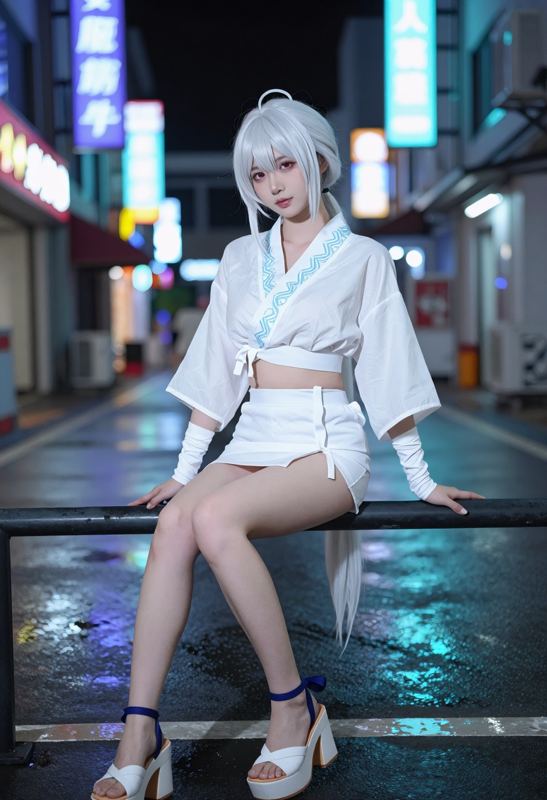

# 配方全文

四个档的可复制句子模块，加十张成品各自的完整提示词。
**规律和取舍在 [`../skills/zimage-portrait-light/SKILL.md`](../skills/zimage-portrait-light/SKILL.md)，这里只放正文。**

> 出图环境：本地 ComfyUI + z-image，8 步 / cfg 1 / res_multistep / shift 3，
> 横幅 1664×936、竖幅 832×1216，之后 4x-ClearRealityV1 超分到长边 2048。
> 提示词是纯中文整段，**粘到豆包 / 即梦 / 通义里同样成立**，不用拆词、不用配负向。
>
> cos 那五条里描述身材的半句已删掉再发，所以你复制出来的图和示例会有细微差别，光的部分不受影响。

---

## 一、句子模块（按档取用）

### 侧脸发丝档（近景，横幅）

拼接顺序：**相机 → 脸 → 皮肤 → 发 → 衣 → 神态 → 场景 → 丝 → 尾**，总长 ~350 字。

| 槽位 | 正文 |
|---|---|
| 相机 | 一张 16:9 横幅的真实照片。她侧对着镜头、只看得到侧脸的轮廓，人在画面右边、从胸口往上入镜，画面左边一大片是虚化开的背景。 |
| 脸 | 一位二十出头的亚洲年轻女性，鹅蛋脸小脸，眼距略宽的清澈杏眼、双眼皮褶较窄，眉毛平直偏细，鼻梁直挺、鼻头小巧，下颌线清晰，长相很甜很出挑。 |
| 皮肤 | 她化着干净的裸妆，皮肤是细腻均匀的哑光质地。 |
| 发 | 浅棕色长卷发披下来，几缕碎发从发顶飞起来。 |
| 神态 | 她微微仰起头看向侧前方，嘴角很轻地扬起来。 |
| **丝**（这一档的命根子） | 光从她耳后斜穿过头发，把外圈那些飞起来的碎发一根一根照透、亮成细细的暖橘色亮线，脸颊外缘留下一条细亮边。 |
| 尾 | 真实照片，浅景深。画面里只有她一个人，没有文字水印。 |

⛔ 句尾不要接「阳光直接照进镜头」——那句会把太阳盘拽进画面。

### 正脸档（近景，横幅）

把上面的「相机」换成正脸版，「丝」换成下面两种之一，其余不动。

- 相机：一张 16:9 横幅的真实照片。她正对着镜头、从胸口往上入镜，人在画面左边三分之一处，右边一大片是虚化开的背景。
- **斜后光**（只亮半边，最像自然光）：光从她左后方斜着打过来，只照亮左半边的头发和左脸颊的外缘，把左边那些飞起来的碎发一根一根照透、亮成细细的暖橘色亮线，右半边留在柔和的暗部里。
- **环光**（整圈亮线，正脸最稳）：光源在她正后方、和她的头一样高，整片背景被从背后照透成发亮的暖金色，她整个头的外圈镶上一整圈细细的暖橘色发丝亮线，两边脸颊外缘各留下一条细亮边。
- 大笑（不挂 LoRA 时 4/4 成立）：她看向镜头笑起来，眼睛弯成两道月牙，脸颊鼓起来，露出整排干净的牙齿，笑得很甜。
- 多人（⛔ 两处必须一起改）：尾句「画面里只有她一个人」→「画面里正好两个人」；场景句「她身后」→「她们身后」。

### 全身档（竖幅）

背景是实景，只能靠场景几何。场景句必须同时满足四条：

1. 光源在她**正后方的头肩高度**，靠身后那个「高的东西」架起来：两栋楼之间的缝 / 巷口 / 门洞 / 两根柱子之间 / 齐腰的花枝之间 / 鸟居的两根立柱。
2. 整片背景被这个光源**从背后照透**成发亮的暖色。⛔ 别写「身后是逆着光的树丛」，会被画成实体暗块。
3. 空气里有被照亮的介质。
4. 光斑落点正向限定：「金色光斑全部落在她身后很远的虚化背景里」。

固定收尾的光句：`阳光直接照进镜头，在整张照片上蒙起一层淡淡的光雾，每个亮的地方都向四周化开一圈柔和的光晕。`

⛔ 全身档要**把提示词压短**（~500 字）。810~891 字时鞋和地面 3 次全部收不进画框，压到 500 字后 15/15 全收进去。

### 自发光特写档（冷调，横幅）

三条内核，**和具体载体无关**：

1. 全图唯一的主光是她手里那个**自己会发光的小东西**；
2. 人整个压在暗部，脸比那个光源暗好几档；
3. 冷调低饱和，全画面只有那个光源是另一个颜色。

⛔ 改暖调直接废，去掉那个发光物件直接废。载体自己挑：掌心里的萤火虫、纸灯笼、屏幕、发光的花。

---

## 二、十张成品的完整提示词

### 01 · 旧书店的光柱（侧脸发丝档）


```
一张 16:9 横幅的真实照片。她侧对着镜头、只看得到侧脸的轮廓，人在画面右边、从胸口往上入镜，画面左边一大片是虚化开的背景。一位二十出头的亚洲年轻女性，鹅蛋脸小脸，眼距略宽的清澈杏眼、双眼皮褶较窄，眉毛平直偏细，鼻梁直挺、鼻头小巧，下颌线清晰，长相很甜很出挑。她化着干净的裸妆，皮肤是细腻均匀的哑光质地。深栗色长发松松地披下来，几缕碎发从发顶飞起来。她穿着藏青色的圆领薄针织衫。她微微仰起头看向侧前方，嘴角很轻地扬起来。午后的旧书店里，她身后是两排高到天花板的木书架，太阳从两排书架之间那道窄缝里斜穿进来、在空气里拉出一道实实在在的光柱，整片书架在她身后虚化成一片流动的暖褐色，光柱里全是被照亮的细小尘埃。光从她耳后斜穿过头发，把外圈那些飞起来的碎发一根一根照透、亮成细细的暖橘色亮线，脸颊外缘留下一条细亮边。真实照片，浅景深。画面里只有她一个人，没有文字水印。
```

### 02 · 芦苇荡的环光（正脸环光 + 大笑）


```
一张 16:9 横幅的真实照片。她正对着镜头、从胸口往上入镜，人在画面左边三分之一处，右边一大片是虚化开的背景。一位二十出头的亚洲年轻女性，鹅蛋脸小脸，眼距略宽的清澈杏眼、双眼皮褶较窄，眉毛平直偏细，鼻梁直挺、鼻头小巧，下颌线清晰，长相很甜很出挑。她化着干净的裸妆，皮肤是细腻均匀的哑光质地。浅棕色长卷发披下来，几缕碎发从发顶飞起来。她穿着奶白色的薄针织开衫。她看向镜头笑起来，眼睛弯成两道月牙，脸颊鼓起来，露出整排干净的牙齿，笑得很甜。深秋傍晚的芦苇荡边，她身后是一整片齐胸高的芦苇，空气里飘着被照亮的芦絮。光源在她正后方、和她的头一样高，整片背景被从背后照透成发亮的暖金色，她整个头的外圈镶上一整圈细细的暖橘色发丝亮线，两边脸颊外缘各留下一条细亮边。真实照片，浅景深。画面里只有她一个人，没有文字水印。
```

### 03 · 夜市灯串下的两个人（多人 + 斜后光 + 人造光）


```
一张 16:9 横幅的真实照片。两个女孩并排站着一起看向镜头，都从胸口往上入镜，她们在画面偏右，左边留出一大片虚化开的背景。两位二十出头的亚洲年轻女性，都是鹅蛋脸小脸，眼距略宽的清澈杏眼、双眼皮褶较窄，眉毛平直偏细，鼻梁直挺、鼻头小巧，下颌线清晰，长相很甜很出挑。她们化着干净的裸妆，皮肤是细腻均匀的哑光质地。左边那个是深栗色的长直发，右边那个是浅金棕色的长卷发，两个人都有几缕碎发从发顶飞起来。左边那个穿着白色的棉布衬衫，右边那个穿着浅杏色的薄针织衫。她们肩膀轻轻靠在一起一起看向镜头笑起来，两个人的眼睛都弯成月牙，脸颊鼓起来，都露出整排干净的牙齿，笑得很甜。夏夜的夜市里，一串一串的暖黄小灯泡就挂在她们身后、只比她们的头高一点、正对着镜头，整条夜市在她们身后虚化成一片流动的橘红色光点，空气里有被灯照亮的烟气在慢慢升上来。光从她们的斜后方打过来，把两个人外圈那些飞起来的碎发一根一根照透、亮成细细的暖橘色亮线，每个人的脸颊外缘都留下一条细亮边。真实照片，浅景深。画面里正好两个人，没有文字水印。
```

### 04 · 掌心里的萤火虫（自发光特写档）


```
一张 16:9 横幅的真实照片。她正对着镜头，只有头和肩膀入镜，脸在画面偏右，是一张很近的特写。一位二十出头的亚洲年轻女性，鹅蛋脸小脸，眼距略宽的清澈杏眼、双眼皮褶较窄，眉毛平直偏细，鼻梁直挺、鼻头小巧，下颌线清晰，长相很甜很出挑。她化着干净的裸妆，皮肤是细腻均匀的哑光质地。黑色的长直发披下来，几缕碎发落在脸颊两边。她把两只手在下巴前面拢成一个空心的球，几只萤火虫停在她的指缝里，黄绿色的光从指缝之间一束一束地漏出来、是整张照片里最亮的东西，把她的下巴、鼻尖、睫毛和两只手的指节从下面照亮。夏夜的草坡上，她身后是一整片被月光照成青蓝色的高草，糊成一片没有细节，更远的地方还飘着十几个同样黄绿色的小光点，散成一片。整张照片是青蓝色的低饱和调子，全画面只有萤火虫的光是黄绿色的。她的脸和头发整个落在柔和的暗部里，比手里那团光暗好几档，只有被萤火虫照到的地方是亮的。真实照片，浅景深。画面里只有她一个人，双手五指完整，没有文字水印。
```

### 05 · 老城巷口（全身档模板）


```
一张竖幅的真实照片。她的整个人从头顶到鞋子完整地落在画框里，鞋子下方还留出一小片地面，人物占画面高度的四分之三。一位二十出头的亚洲年轻女性，鹅蛋脸小脸，眼距略宽的清澈杏眼，鼻梁直挺，长相很甜很出挑。身材纤细，肩窄腰细，两条腿又长又直。浅棕色长卷发披散到胸口，几缕碎发被风吹起来。她穿着米白色的短袖针织上衣，下身是浅蓝色的高腰牛仔短裤，两条腿完全露在外面；脚上是一双白色的帆布鞋。她侧身站着，重心落在一条腿上，一只手垂在身侧，另一只手把被风吹到脸上的头发别到耳后，转头看向镜头，笑得很轻。傍晚的老城巷口，太阳低低地卡在她身后两栋老楼之间的那道缝里、和她的头一样高，正对着镜头，整条巷子被从背后照透成发亮的暖金色，金色的光斑全部落在她身后很远的虚化背景里，空气里浮着被照亮的细尘。阳光直接照进镜头，在整张照片上蒙起一层淡淡的光雾，每个亮的地方都向四周化开一圈柔和的光晕。真实照片，浅景深。画面里只有她一个人，双手五指完整，没有文字水印。
```

### 06 · cos · 白花田（全身档 + 光源要离人近）


```
她的整个人从头顶到鞋子完整地落在画框里，鞋子下方还留出一小片地面，头顶上方留出一点余量，人物占画面高度的四分之三。一位二十出头的亚洲年轻女性 cosplayer，窄长的鹅蛋小脸、下颌角收窄，长相很甜很出挑。身材高挑，腰肢很细，两条腿又长又直。她 cosplay 的是《崩坏：星穹铁道》里的流萤，星核猎手里的假面愚者。白金色的长发束成低马尾垂到腰际。淡黄绿色的美瞳，轻挑的眼尾，樱粉色的唇。她穿着一件白色的连衣裙，领口开成圆润的方形、露出锁骨和肩头，肩上罩着一层能透光的白色薄纱，腰上系着一条淡蓝色的细带打成蝴蝶结。裙摆是多层的白色薄纱，一直垂到膝盖上方，走动时层与层之间能看见光透过来。脚上是一双白色的系带凉鞋。她原地转了半圈，多层的薄纱裙摆被离心力整片甩开成一个圆。她仰着脸笑起来，眼睛弯成两道弧。一整片开满白色小花的花田里，太阳低低地悬在她身后齐腰的花枝之间、正对着镜头，每一朵白花都被从背后照透成一小团发亮的暖金色，空气里飘着被照亮的花絮。真实照片，单反相机拍的 cos 写真，布料有真实的织物纹理和自然的褶皱，假发有明显的发丝分束，皮肤细腻真实。浅景深，画面里只有她一个人，没有文字水印。
```

### 07 · cos · 紫藤花架（侧脸发丝档，全批发丝光最强）


```
她的头和肩膀填满整个竖幅画面：额头顶到画框上沿、下巴落在画面正中，两边脸颊几乎碰到画框左右两边，肩膀在画框底部被裁掉。一位二十出头的亚洲年轻女性 cosplayer，窄长的鹅蛋小脸，脸颊平顺内收、下颌角收窄、下巴是尖的，眼距略宽的清澈杏眼，鼻梁直挺，长相很甜很出挑。她 cosplay 的是《鬼灭之刃》里的蝴蝶忍。黑色的长发在脑后挽成一个圆髻，发梢渐变成浅紫色，髻上别着一枚白色的蝴蝶发饰，鬓边垂下两缕碎发。浅紫色的美瞳，瞳孔外圈是深一点的紫，眼尾很轻地上挑，眉毛细长，唇是浅粉色。深色的立领制服扣到脖子下方，肩上罩着一件能透光的半透明羽织，羽织上印着大片渐变的蝶翅花纹。她微微歪着头，一串紫藤花正垂在她的脸颊旁边。她的眼睛弯起来，嘴角挂着一个很温柔的笑。背景是被照透成暖紫金色的紫藤花穗，虚化成一片；光从她耳后斜穿过头发，把飞起来的碎发一根一根照透成细细的亮线。真实照片，单反相机拍的 cos 写真，皮肤细腻真实，发丝分束清晰，睫毛根根分明，虹膜有一小点高光。画面里只有她一个人，没有文字水印。
```

### 08 · cos · 火盆（把太阳换成火）


```
画框的下沿正好切在她的膝盖下方，膝盖以下的小腿和鞋子都在画面外面，她的上半身占满画面的大部分。一位二十出头的亚洲年轻女性 cosplayer，窄长的鹅蛋小脸、下颌角收窄，长相很甜很出挑。身材高挑，腰肢很细，两条腿又长又直。她 cosplay 的是《鸣潮》里的长离。白发红挑染的长发高高束起垂到腰下。金红色的美瞳，红色上扫的眼尾，正红色的哑光唇。她穿着一件红金相间的紧身短上衣，身上缠着好几条很长的红色薄纱飘带、飘带一直垂到身后很远的地方，腰上系着一条金色的镂空腰饰。下身是红金色的短裙，裙筒是完整闭合的一圈、四周一样齐地把大腿包住，裙外罩着几层能透光的红色薄纱，纱摆很长、被风一吹就整片扬起来。两条长腿上是黑红色的半透明长袜，大腿外侧绑着一圈金色的细链。她侧对着火盆站着，一只手臂向斜上方抬起，身上的飘带被热风整片托起来。她把脸转向镜头，眼神是笃定的。一片空地上，几只燃着火的铜盆就摆在她身后与她的肩膀同高，斜吹的火苗把她的发梢和飘带照出一圈发亮的橘红边，空气里浮着被照亮的火星。真实照片，单反相机拍的 cos 写真，布料有真实的织物纹理和自然的褶皱，假发有明显的发丝分束，皮肤细腻真实。浅景深，画面里只有她一个人，没有文字水印。
```

### 09 · cos · 舞台（人造光里几何最硬的一个）


```
画框的下沿正好切在她的腰上，腰以下的整个下半身都在画面外面，她的头和上半身占满整个竖幅画面。一位二十出头的亚洲年轻女性 cosplayer，窄长的鹅蛋小脸，脸颊平顺内收、下颌角收窄、下巴是尖的，眼距略宽的清澈杏眼，鼻梁直挺，长相很甜很出挑。她 cosplay 的是初音未来，编号 01 的虚拟歌手。青绿色的头发在两侧扎成两束极长的双马尾，发束一直垂到腰以下，发根处各套着一个黑红相间的发环，额前是齐整的刘海。一双青绿色的眼瞳，瞳孔里有细密的环形纹路，眼线细而干净、眼尾轻轻上挑，唇是透亮的浅粉色。她穿着一件黑灰色的无袖贴身上衣，领口是高的，肩膀完全裸露，领口下系着一条青绿色的领带垂在胸前。她一只手举着麦克风，另一只手向头顶的斜上方笔直地伸出去。仰着脸，眼睛闭着，唱得很投入。一个夜晚的舞台上，成排的蓝紫色射灯就架在她身后与头同高、正对着镜头，干冰的薄雾被从背后照透成发亮的蓝紫色，观众席的光点全部虚化在她身后。真实照片，单反相机拍的 cos 写真，布料有真实的织物纹理和自然的褶皱，假发有明显的发丝分束，皮肤细腻真实。浅景深，画面里只有她一个人，没有文字水印。
```

### 10 · cos · 夜街霓虹（冷调也能有轮廓光）



```
她的整个人从头顶到鞋子完整地落在画框里，鞋子下方还留出一小片地面，头顶上方留出一点余量，人物占画面高度的四分之三。一位二十出头的亚洲年轻女性 cosplayer，窄长的鹅蛋小脸、下颌角收窄，长相很甜很出挑。身材高挑，腰肢很细，两条腿又长又直。她 cosplay 的是《绝区零》里的星见雅。雪白色的长发束成低马尾垂到腰下，齐眉的刘海。赤红色的美瞳，细而平直的眼线，冷调的裸粉色唇。她穿着一件白色的和风短打上衣，胸前的衣襟交叠、边缘绣着浅蓝色的波纹，两条手臂完全裸露在外，手腕上各缠着一圈白色的布带。下身是白色的短裙裤，一侧的开衩很高，露出整条大腿的线条。脚上是一双白色的和风高台木屐，鞋底很厚，脚踝处系着深蓝色的绳带。她坐在商店街边的栏杆上，两条腿垂下来晃着，一只手撑在栏杆上。低头看向镜头，眼神懒懒的。夜晚的商店街上，成排的蓝紫色和青色霓虹招牌就在她身后与肩同高、正对着镜头，湿的地面被照出一条条发亮的青蓝光带，空气里浮着被照亮的水汽。真实照片，单反相机拍的 cos 写真，布料有真实的织物纹理和自然的褶皱，假发有明显的发丝分束，皮肤细腻真实。浅景深，画面里只有她一个人，没有文字水印。
```
