# 三十张成品的完整提示词

> 全部是**纯中文整段**，直接粘进出图框就行 —— 不用拆词、不用配负向。
> 每一节先给图，再给它的判据表，最后是**一字不改**的完整提示词。
>
> ⚠️⚠️ **01~11 和 12~30 是两批，隔着一次归因，别混着抄。**
> 01~11 出在 2026-08-29 之前，其中七条带着两个后来被证伪的写法
> （`和她的脸一样高`、`眼睛里有一颗反光点`），每条下面都标了要改哪几处。
> 12~30 是 2026-08-30 按现行 `skills/portrait-light/SKILL.md` 重出的，可以直接抄。
>
> ⚠️ 换种子的摆幅比换措辞大得多。12~30 是 **每条 3 个种子、5 批共 180 张候选**里人工挑的
> （整体挑中率 19/180）。直接抄这些字得到的未必是同一张，多抽几个种子再挑。

## 这 30 张是怎么分的

| | 01~11 | 12~20 | 21~30 |
|---|---|---|---|
| 画幅 | 16:9 | 12~18 是 16:9，19/20 竖幅 | 竖幅 2:3 |
| 写法 | 段落式 | 段落式 | **标签式分段**（`【穿搭】`/`【场景】`/`【光线与质感】`…）|
| 组织方式 | 光位 + 几何线 + 补色对 | 同左，加上成像系统和皮肤档两轴 | 每张只定一个**「成立点」**，其余留白 |
| 主光 | 逆光 / 轮廓光为主 | **必打脸光**（亮面 + 暗面 + 鼻侧三角 + 睫毛投影）| 由成立点决定，**允许不打脸光** |
| LoRA | 写真 7 张无，cos 4 张挂 | 全部不挂 | 全部不挂 |

⭐ **12~20 和 21~30 是两种方法，都成立，挑中率却差很多**：把每条判据都套满的那两批是 1/12 和 1/12，
只定一个成立点的那两批是 6/12 和 4/12。原因和用法见 SKILL.md §0.5 —— **不是判据错了，是套满会做出同质化**。

⭐ **标签式分段在 z-image 上照样成立**（21~30 全是这么写的，一张没崩）。
原模板说标签只是内部脚手架、最终不显示；实测**留着标签直接出图也没问题**，
好处是每一块能单独换、单独查。要连贯段落就把标签去掉，两种排法都验过。

⚠️ **12~30 全部是底模直出**（z-image turbo，8 步 cfg 1.0，res_multistep / simple，shift 3，不挂任何 LoRA）。
每条只写了脸、发型、穿搭、场景、动作、光线这几块 —— **身形没写**。
要控身材就自己在穿搭后面接一段，其余照抄。

## 总表

### 01~11（旧批，16:9）


| # | 场景 | 景别 | 光位 | 光源实体 | 几何线 |
|---|---|---|---|---|---|
| 01 | 窗边侧光 | 近景 | 前侧 45° 伦勃朗 | 一扇老木格窗 | 窗棂格子 |
| 02 | 海边正面金光 | 半身 | 远处的正前方 | 太阳盘 | 海面的碎金反光带 |
| 03 | 黄昏天台天际线 | 半身 | 侧前方 45° | 太阳盘（贴在天际线上） | 天际线横线 + 幕墙竖直光带 |
| 04 | 雨夜天桥车灯 | 半身 | 侧前方（齐胸高灯箱） | 暖橘灯箱 | 桥栏透视 + 两条车灯长光带 |
| 05 | 樱花隧道 | 中景 | 远处的正前方（隧道尽头） | 太阳盘 | 樱花隧道的透视 |
| 06 | 清晨梯田晨雾 | 中景 | 侧前方 45° | 太阳盘（山脊上） | 梯田一层层的曲线 |
| 07 | 湖边篝火银河 | 中景 | 侧前方（身后半米的篝火） | 篝火本体 | 银河带 + 湖面倒影 |
| 08 | 爱莉希雅_黄昏旋转木马 | 半身 | 正前方的灯泡阵 | 一整排小灯泡 | 旋转木马顶棚的弧线 |
| 09 | 蝴蝶忍_黄昏紫藤花架 | 中景 | 侧后方（穿过花架） | 太阳盘 | 紫藤长廊的透视 |
| 10 | 明日香_黄昏铁桥 | 中景 | 侧前方 45° | 太阳盘 | 桥架透视 + 海面反光带 |
| 11 | 蕾姆_蓝调雪夜橱窗 | 半身 | 侧前方（齐脸高橱窗灯箱） | 橱窗暖橘灯箱 | 一排路灯的雪街透视 |

### 12~20（本 skill 骨架：必打脸光 + 几何线 + 补色对）

| # | 场景 | 景别 | 光位 | 主光色温 | 成像系统 | 皮肤档 | 几何线 |
|---|---|---|---|---|---|---|---|
| 12 | 亚麻连衣裙·绿荫回廊 | 半身 | 侧前 45° | 暖白色 | 数码 | 干净 | 一排拱窗排成的透视线 |
| 13 | 泳装罩衫·傍晚泳池 | 中景 | 侧前 45° | 暖金色 | VHS | 纹理 | 海面那条碎金反光带 |
| 14 | JK 制服·黄昏站台 | 半身 | 正前偏下 | 暖橘色 | 数码 | 干净 | 站台边沿那条灯带 |
| 15 | 运动套装·夜球场 | 中景 | 正前偏下 | 冷白色 | 数码 | 干净 | 球场的白色边线 |
| 16 | 皮夹克·深夜电玩城 | 近景 | 侧前 45° | 青蓝色 | VHS | 纹理 | 街机顶沿那条边线 |
| 17 | 丝质吊带·深夜阳台 | 近景 | 正前偏下 | 暖黄色 | 柔雾 | 干净 | 栏杆顶沿那条横线 |
| 18 | 风衣·雨后石桥 | 半身 | 正前偏下 | 暖橘色 | VHS | 纹理 | 石桥栏杆的透视 |
| 19 | 马面裙·夜里的茶楼 | 半身 | 正前偏下 | 暖橘色 | 数码 | 干净 | 木格门扇的横楣 |
| 20 | 机能夹克·自动贩卖机 | 半身 | 侧前 45° | 青蓝色 | 数码 | 纹理 | 两栋楼之间那道天缝 |

### 21~30（南鸢档：一个成立点驱动，标签式分段）

| # | 场景 | 成立点 | 风格入口 | 成像系统 | 机位 |
|---|---|---|---|---|---|
| 21 | 条纹针织·深夜电话亭 | 场景关系 + 成像方式 | Y2K猫系街头 | CCD 直闪 | 近距离广角轻俯拍 |
| 22 | 豹纹衬衫·复古沙发 | 妆面 + 成像方式 | 豹纹复古直闪 | 机顶直闪 | 近距离直闪特写 |
| 23 | 橘色背心·夏日防波堤 | 场景 + 镜头 | 橘子汽水海边 | CCD 卡片机 | 低机位广角 |
| 24 | 花衬衫·热带旅馆 | 成像方式 + 场景 | 热带 VHS travelogue | VHS | 手机近距离抓拍感 |
| 25 | 斜襟短衫·旧木室内 | 场景 + 光线 | 古风旧室鸟笼 | 尼康 + film halation | 门框窥视 |
| 26 | 棉布上衣·雏菊花丛 | 场景 + 镜头 | 雏菊花丛富士 | 富士 | 昆虫视角 |
| 27 | 格纹衬衫·青苹果果园 | 场景 + 镜头 | 夏日果园 35mm | 35mm 胶片 | 藏在枝叶后面的镜头感 |
| 28 | 华夫格家居服·欧式卧室 | 光线 + 妆面 | 复古欧式柔雾室内 | Pro-Mist 柔雾 | 桌面低机位 |
| 29 | 浅蓝衬衫·夜间办公室 | 场景关系 + 成像方式 | 黑板职感直闪 | 机顶直闪 | 硬闪近景 |
| 30 | 教练夹克·雨夜街口 | 光线 + 成像方式 | 雨夜霓虹街拍 | 35mm 数码 | 路人视角的远距离抓拍 |

---

## 01_写真_窗边侧光

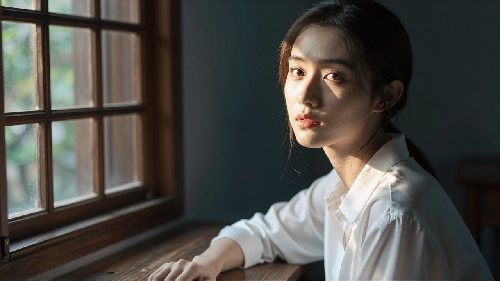

| 光位 | 光源实体 | 几何线 | 背景 | 补色对 | 黑锚 |
|---|---|---|---|---|---|
| 前侧 45° 伦勃朗 | 一扇老木格窗 | 窗棂格子 | 一整面深青蓝的暗墙 | 暖金光柱 ↔ 室内冷青蓝暗部 | 窗棂 + 室内暗部 |

`453 字 · 1664x936 · seed 70100 · 近景`

```
一张 16:9 横幅的真实照片。她在画面右边三分之一处、从胸口往上入镜，脸占画面高度的三分之一，左边三分之二让给背景。一位二十出头的亚洲年轻女性，鹅蛋脸小脸，眼距略宽的清澈杏眼、双眼皮褶较窄，眉毛平直偏细，鼻梁直挺、鼻头小巧，下颌线清晰，长相很甜很出挑。她化着干净的裸妆，皮肤是细腻均匀的哑光质地。深栗色的长发松松挽在脑后，几缕碎发垂在脸颊边。她穿着一件象牙白的真丝衬衫，领口敞开着。她侧身坐在窗边的旧木桌前，转过头看向镜头，眼神很静。清晨，一道光从她左前方的老木格窗照进来，正好斜劈在她的半张脸上：额头、颧骨和鼻梁被照得发亮，鼻子侧面下方留下一小块三角形的亮斑，另外半张脸整个落在柔和的暗部里。她的睫毛在被照亮那半边的脸颊上投下细细的影子，嘴唇边缘有一小点高光。画面左边三分之二是那扇老木格窗和窗外虚化开的一片绿，窗棂是很深的木色。空气里浮着被这道光照亮的细尘，一粒粒悬在光里。整间屋子是深青蓝色的暗调，只有这道光和她脸上被照到的地方是暖金色的。真实照片。画面里只有她一个人，双手五指完整，没有文字水印。
```

## 02_写真_海边正面金光

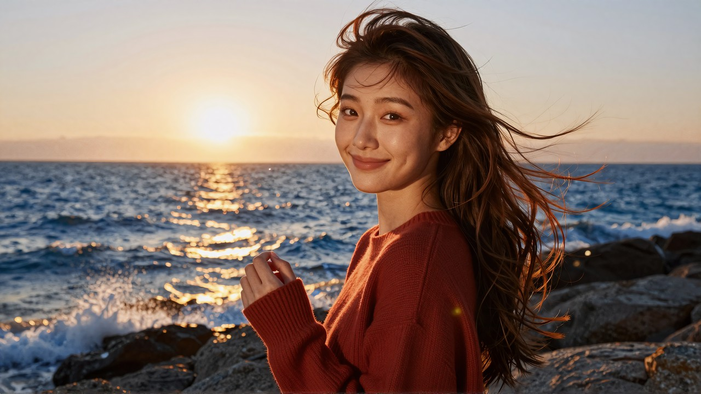

> ⚠️ **这条写在 2026-08-29 归因之前，复用时改这几处**（正文一个字没动，因为上面那张图就是这些字出的）：
> 
> ① `和她的脸／头一样高` —— 那是**镜头的位置**，太阳会被挪到侧后方去。改成 `在她左前方 45 度、比她的脸高一点`（侧前 45°）或 `在她正前方、比她的脸低一截`（正前偏下）。
> ② `眼睛里有一颗清楚的暖金色反光点` —— 成对器官写单数只会点亮一只眼。改成 `两只眼睛里各有一小点同样大小、同样位置的暖金色反光`。

| 光位 | 光源实体 | 几何线 | 背景 | 补色对 | 黑锚 |
|---|---|---|---|---|---|
| 远处的正前方 | 太阳盘 | 海面的碎金反光带 | 海 + 天两大块 | 暖金的脸 ↔ 深蓝的海和天 | 礁石 |

`450 字 · 1664x936 · seed 70237 · 半身`

```
一张 16:9 横幅的真实照片。她在画面右边三分之一处、从腰往上入镜，左边三分之二让给背景。一位二十出头的亚洲年轻女性，鹅蛋脸小脸，眼距略宽的清澈杏眼、双眼皮褶较窄，眉毛平直偏细，鼻梁直挺、鼻头小巧，下颌线清晰，长相很甜很出挑。她化着干净的裸妆，皮肤是细腻均匀的哑光质地。浅棕色的长卷发被海风整片吹向一侧。她穿着一件赭红色的粗针织毛衣，袖子挽到小臂。她侧身站在一块大礁石上，转过头正对着镜头，被风眯了一下眼睛，笑起来。黄昏，太阳低低地贴在海面上、正好在她的正前方、和她的脸一样高、直直地照着她，把她整张脸和上半身照成饱满的暖金色，睫毛在脸颊上投下细影，眼睛里有一颗清楚的暖金色反光点。她的头发外圈反而是暗的，只有被风吹散的那几缕透出光。画面左边三分之二是整片深蓝色的海，浪打在礁石上溅起的水雾被这道光照成一团团金色，海面上有一条从太阳一直铺到岸边的碎金色反光带。空气里满是被照亮的细小水雾。整张照片是暖金的脸和上半身，压在深蓝色的海和天顶上。真实照片。画面里只有她一个人，双手五指完整，没有文字水印。
```

## 03_写真_黄昏天台天际线

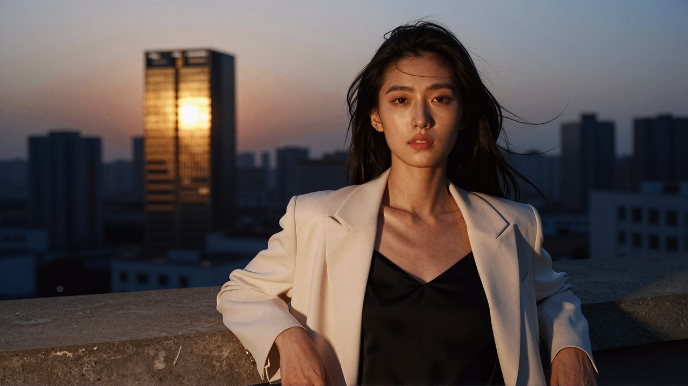

> ⚠️ **这条写在 2026-08-29 归因之前，复用时改这几处**（正文一个字没动，因为上面那张图就是这些字出的）：
> 
> ① `和她的脸／头一样高` —— 那是**镜头的位置**，太阳会被挪到侧后方去。改成 `在她左前方 45 度、比她的脸高一点`（侧前 45°）或 `在她正前方、比她的脸低一截`（正前偏下）。
> ② `眼睛里有一颗清楚的暖金色反光点` —— 成对器官写单数只会点亮一只眼。改成 `两只眼睛里各有一小点同样大小、同样位置的暖金色反光`。

| 光位 | 光源实体 | 几何线 | 背景 | 补色对 | 黑锚 |
|---|---|---|---|---|---|
| 侧前方 45° | 太阳盘（贴在天际线上） | 天际线横线 + 幕墙竖直光带 | 天 + 楼群两大块 | 暖金 ↔ 冷蓝楼影 | 背光那侧的楼群剪影 |

`466 字 · 1664x936 · seed 71100 · 半身`

```
一张 16:9 横幅的真实照片。她在画面右边三分之一处、从腰往上入镜，左边三分之二让给背景。一位二十出头的亚洲年轻女性，鹅蛋脸小脸，眼距略宽的清澈杏眼、双眼皮褶较窄，眉毛平直偏细，鼻梁直挺、鼻头小巧，下颌线清晰，长相很甜很出挑。她化着干净的裸妆，皮肤是细腻均匀的哑光质地。黑色的长发被风吹向一侧，几缕贴在脸颊边。她穿着黑色的丝质吊带，外面松松披着一件米白色的西装外套。她靠在天台的水泥矮墙上，转过头看向镜头，下巴微微抬起来。黄昏，太阳还没落下去、是一个明晃晃的圆盘、就贴在她左前方的城市天际线上、和她的脸一样高、斜着照过来，把她半张脸和锁骨照成饱满的暖金色，鼻子侧面下方留一小块三角形亮斑，另外半张脸落在柔和的暗部里，眼睛里有一颗清楚的暖金色反光点。画面左边三分之二只有两样东西：一条笔直干净的城市天际线，和天际线上方一整片从橘金渐变到靛蓝的天；对面几栋楼的玻璃幕墙把太阳反成一条竖直的金色光带。空气里浮着被夕阳照亮的城市浮尘。画面里最暗的是背光那一侧整片楼群的冷蓝色剪影。真实照片。画面里只有她一个人，双手五指完整，没有文字水印。
```

## 04_写真_雨夜天桥车灯

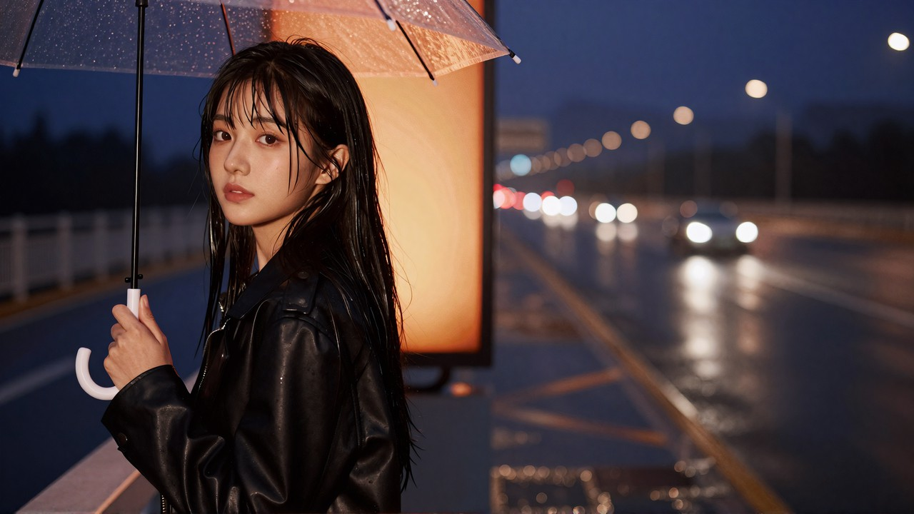

| 光位 | 光源实体 | 几何线 | 背景 | 补色对 | 黑锚 |
|---|---|---|---|---|---|
| 侧前方（齐胸高灯箱） | 暖橘灯箱 | 桥栏透视 + 两条车灯长光带 | 马路 + 湿黑桥面两大块 | 暖橘灯箱车灯 ↔ 冷蓝雨夜 | 湿黑发亮的路面 |

`402 字 · 1664x936 · seed 71374 · 半身`

```
一张 16:9 横幅的真实照片。她在画面左边三分之一处、从腰往上入镜，右边三分之二让给背景。一位二十出头的亚洲年轻女性，鹅蛋脸小脸，眼距略宽的清澈杏眼、双眼皮褶较窄，眉毛平直偏细，鼻梁直挺、鼻头小巧，下颌线清晰，长相很甜很出挑。她化着干净的裸妆，皮肤是细腻均匀的哑光质地。黑色的长直发被雨打湿了一点，几缕贴在脸颊边。她穿着黑色的皮夹克，手里拎着一把收起来的透明伞。她靠在天桥的栏杆上侧身站着，转过头看向镜头。雨刚停的深夜，她右前方立着一块齐胸高、亮着暖橘色的灯箱、直直地照着她，把她半张脸照成暖橘色，另外半张落在暗部里，眼睛里有一点橘色的反光。画面右边三分之二是天桥笔直的栏杆一路收到远处，桥下的马路上两条车灯拉成的长光带一红一白，直直地穿过整个画面。空气里还飘着被灯照亮的细雨丝。整张照片是暖橘的灯箱和车灯，压在冷蓝色的雨夜和湿黑发亮的桥面上。真实照片。画面里只有她一个人，双手五指完整，没有文字水印。
```

## 05_写真_樱花隧道

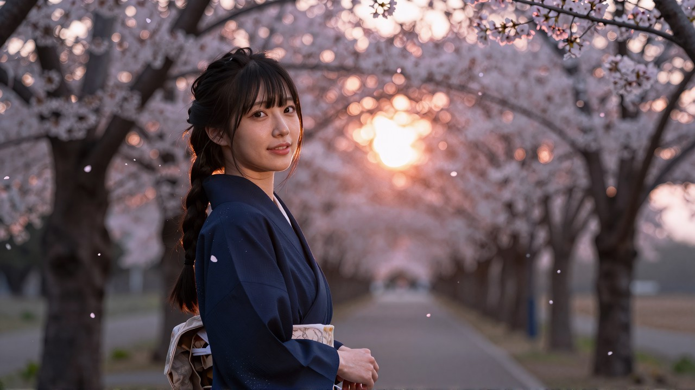

> ⚠️ **这条写在 2026-08-29 归因之前，复用时改这几处**（正文一个字没动，因为上面那张图就是这些字出的）：
> 
> ① `和她的脸／头一样高` —— 那是**镜头的位置**，太阳会被挪到侧后方去。改成 `在她左前方 45 度、比她的脸高一点`（侧前 45°）或 `在她正前方、比她的脸低一截`（正前偏下）。
> ② `眼睛里有一颗清楚的暖金色反光点` —— 成对器官写单数只会点亮一只眼。改成 `两只眼睛里各有一小点同样大小、同样位置的暖金色反光`。

| 光位 | 光源实体 | 几何线 | 背景 | 补色对 | 黑锚 |
|---|---|---|---|---|---|
| 远处的正前方（隧道尽头） | 太阳盘 | 樱花隧道的透视 | 花隧道一大片 | 暖粉金 ↔ 天顶深靛蓝 | 两边黑褐色树干 |

`461 字 · 1664x936 · seed 71511 · 中景`

```
一张 16:9 横幅的真实照片。她站在画面左边三分之一处、从膝盖往上入镜，身高占满画面高度的四分之三，右边三分之二整个让给风景。一位二十出头的亚洲年轻女性，鹅蛋脸小脸，眼距略宽的清澈杏眼、双眼皮褶较窄，眉毛平直偏细，鼻梁直挺、鼻头小巧，下颌线清晰，长相很甜很出挑。她化着干净的裸妆，皮肤是细腻均匀的哑光质地。黑色的长发编成一条辫子垂在肩前，几缕碎发飞起来。她穿着藏青色的和服，白色的半衿露出一条边。她站在樱花隧道正中间，侧过身回头看向镜头，笑得很轻。清晨，一条樱花树在头顶拱成的长长的花隧道，太阳还没升高、是一个明晃晃的圆盘、正好卡在隧道最尽头、和她的脸一样高、顺着隧道直直地照过来，把她整张脸照成暖粉金色，眼睛里有一颗清楚的金色反光点。画面右边三分之二是这条一直收到尽头的花隧道，两边的黑褐色树干一根一根排下去，头顶整片樱花被从背后照透成发亮的暖粉金色。空气里满是正在飘落的花瓣，一片片被照得透亮。画面里最暗的是两边那些黑褐色的树干；天顶还是没褪干净的深靛蓝色。真实照片。画面里只有她一个人，双手五指完整，没有文字水印。
```

## 06_写真_清晨梯田晨雾

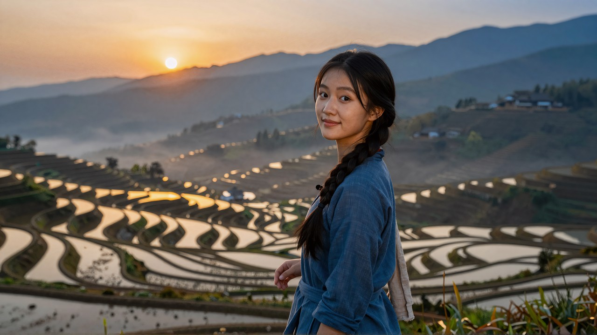

> ⚠️ **这条写在 2026-08-29 归因之前，复用时改这几处**（正文一个字没动，因为上面那张图就是这些字出的）：
> 
> ① `和她的脸／头一样高` —— 那是**镜头的位置**，太阳会被挪到侧后方去。改成 `在她左前方 45 度、比她的脸高一点`（侧前 45°）或 `在她正前方、比她的脸低一截`（正前偏下）。
> ② `眼睛里有一颗清楚的暖金色反光点` —— 成对器官写单数只会点亮一只眼。改成 `两只眼睛里各有一小点同样大小、同样位置的暖金色反光`。

| 光位 | 光源实体 | 几何线 | 背景 | 补色对 | 黑锚 |
|---|---|---|---|---|---|
| 侧前方 45° | 太阳盘（山脊上） | 梯田一层层的曲线 | 山脊 + 晨雾两大块 | 暖金 ↔ 冷青雾和山影 | 背光那侧山脊剪影 |

`439 字 · 1664x936 · seed 71785 · 中景`

```
一张 16:9 横幅的真实照片。她站在画面右边三分之一处、从膝盖往上入镜，身高占满画面高度的四分之三，左边三分之二整个让给风景。一位二十出头的亚洲年轻女性，鹅蛋脸小脸，眼距略宽的清澈杏眼、双眼皮褶较窄，眉毛平直偏细，鼻梁直挺、鼻头小巧，下颌线清晰，长相很甜很出挑。她化着干净的裸妆，皮肤是细腻均匀的哑光质地。黑色的长发松松编成一条粗辫子垂在胸前。她穿着靛蓝色的粗布上衣，肩上搭着一条素色的布巾。她站在田埂上侧身回头看向镜头，笑得很淡。清晨，太阳刚从对面山脊升起来、是一个明晃晃的圆盘、就在她左前方、和她的脸一样高、斜着照过来，把她半张脸照成暖金色，另外半张落在柔和的暗部里，眼睛里有一颗金色的反光点。画面左边三分之二是一层一层顺着山势弯下去的梯田，每一格水田都把太阳反成一块亮金色，一路排到山脚；山脊上方是一整片从橘金渐变到靛蓝的天。山谷里整片浮着晨雾，被这道光照成发亮的金色。画面里最暗的是背光那一侧山脊的冷青色剪影。真实照片。画面里只有她一个人，双手五指完整，没有文字水印。
```

## 07_写真_湖边篝火银河


> ⭐ **这条里的「和她的头一样高」是唯一被允许的那种** —— 光源在**正后方**（身后半米的篝火），
> 这是真逆光，高度写法不会把它挪走。⛔ 换成任何一个别的方位就不成立了，见 SKILL.md 第 3 步②。

| 光位 | 光源实体 | 几何线 | 背景 | 补色对 | 黑锚 |
|---|---|---|---|---|---|
| 侧前方（身后半米的篝火） | 篝火本体 | 银河带 + 湖面倒影 | 夜空 + 湖两大块 | 橘红火星 ↔ 冷蓝银河 | 远处山脊剪影 |

`478 字 · 1664x936 · seed 70648 · 中景`

```
一张 16:9 横幅的真实照片。她站在画面右边三分之一处、从膝盖往上入镜，身高占满画面高度的四分之三，左边三分之二整个让给风景。一位二十出头的亚洲年轻女性，鹅蛋脸小脸，眼距略宽的清澈杏眼、双眼皮褶较窄，眉毛平直偏细，鼻梁直挺、鼻头小巧，下颌线清晰，长相很甜很出挑。她化着干净的裸妆，皮肤是细腻均匀的哑光质地。黑色的长发披下来，几缕碎发被夜风吹起来。她穿着米白色的高领和一件厚织纹的黑色针织外套，抱着膝盖坐在湖边的大石头上。她侧身坐着，转过头看向镜头。没有月亮的深夜，她正后方半米的地上烧着一堆篝火、火苗窜到和她的头一样高、正对着镜头，是整张照片里唯一的光源。整片橘红色的火星从火里升起来，飘满她身后一大片夜空，一粒粒亮着往上飞。火光把她的发梢、肩线和侧脸外缘整个镶上一圈暖橘色的亮边，她其余的部分落在柔和的暗部里。画面左边三分之二是一整条横过天空的银河，密密的星星铺满深蓝色的夜空，底下的湖面像镜子一样把整条银河原样反上来。画面里最暗的是远处山脊那条黑色的剪影；冷蓝的银河和暖橘的火星各占半张照片。真实照片。画面里只有她一个人，双手五指完整，没有文字水印。
```

## 08_cos_爱莉希雅_黄昏旋转木马

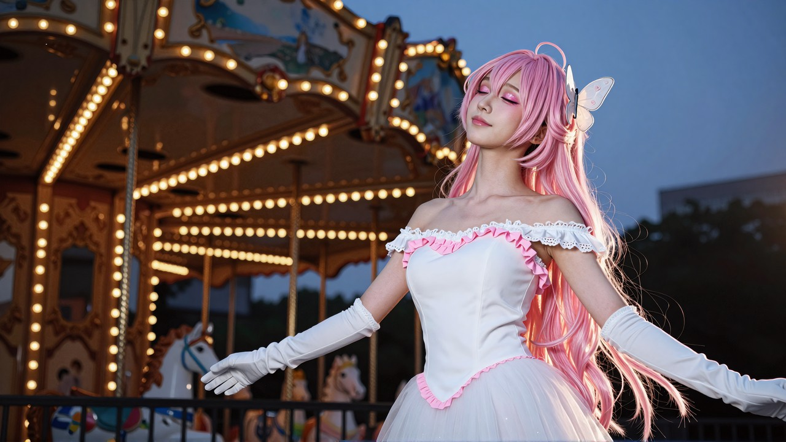

> ⚠️ **这条写在 2026-08-29 归因之前，复用时改这几处**（正文一个字没动，因为上面那张图就是这些字出的）：
> 
> ① `和她的脸／头一样高` —— 那是**镜头的位置**，太阳会被挪到侧后方去。改成 `在她左前方 45 度、比她的脸高一点`（侧前 45°）或 `在她正前方、比她的脸低一截`（正前偏下）。

| 光位 | 光源实体 | 几何线 | 背景 | 补色对 | 黑锚 |
|---|---|---|---|---|---|
| 正前方的灯泡阵 | 一整排小灯泡 | 旋转木马顶棚的弧线 | 暮蓝天一大块 | 暖金灯泡 ↔ 暮蓝天 | 木马黑色立柱 |

`636 字 · 1664x936 · seed 6103 · 半身 · 挂 LoRA`

```
一张 16:9 横幅的真实照片。她在画面右三分之一、从腰往上入镜，脸占画面高度三分之一，左边三分之二让给背景。一位二十出头的亚洲年轻女性 cosplayer，窄长的鹅蛋小脸，脸颊平顺内收、下颌角收窄、下巴是尖的，眼距略宽的清澈杏眼，鼻梁直挺，长相很甜很出挑。身材高挑，胸大而饱满，腰肢很细，两条腿又长又直。她 cosplay 的是《崩坏3》里的爱莉希雅。樱花粉色的长发披散下来，发梢微微卷曲，头顶靠右侧别着一枚白色的蝴蝶发饰，发饰的翅膀是半透明的。浅粉色的美瞳，眼尾微微上翘，眼皮上刷了一层带细闪的珠光粉色眼影，卧蚕打了高光，唇是水润的浅樱粉色，整张脸是柔和明亮的。她穿着一件白色的露肩紧身上衣，一字领把两侧肩膀完全露出来，胸口下方是一圈粉色的褶边；两条手臂上是白色的长手套一直到手肘上方、手套边缘缀着细细的蕾丝。她把两条手臂向两侧张开，仰起头看向回廊的拱顶，裙摆散开。闭着眼睛，嘴角带着满足的笑。黄昏的游乐园，她站在旋转木马旁边，木马顶棚边缘那一整排暖金色的小灯泡就在她正前方、和她的脸一样高、直直地照着她，把她整张脸照成暖金色：额头、颧骨和鼻梁最亮，眼睛里映着一排小小的金色灯点；左边三分之二是整座亮起来的旋转木马，几十个灯泡虚化成一片一片的暖金光斑，天顶是还没褪干净的暮蓝色；空气里浮着被灯照亮的细尘；画面里最暗的是木马那些黑色的立柱和顶棚的暗部。真实照片，单反相机拍的 cos 写真，布料有织物纹理，假发有发丝分束，皮肤细腻真实。画面里只有她一个人，没有文字水印。
```

## 09_cos_蝴蝶忍_黄昏紫藤花架

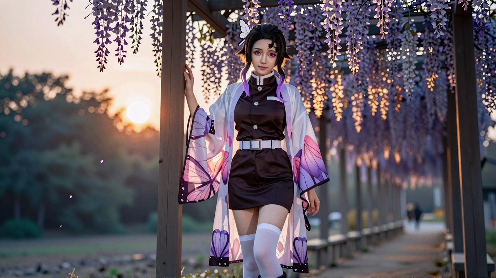

> ⭐ **这条里的「和她的头一样高」也是被允许的那种** —— 太阳卡在她**身后**花架的两根立柱之间，
> 是真逆光。⛔ 但它只镶边、没打脸（SKILL.md 第 2 步说的那类），当年十张里只有它被选中，
> 后来的批次已经不这么打了。

| 光位 | 光源实体 | 几何线 | 背景 | 补色对 | 黑锚 |
|---|---|---|---|---|---|
| 侧后方（穿过花架） | 太阳盘 | 紫藤长廊的透视 | 花廊一大片 | 暖金落日 ↔ 饱和紫藤 | 花架黑立柱 + 黑和服 |

`550 字 · 1664x936 · seed 6103 · 中景 · 挂 LoRA`

```
一张 16:9 横幅的真实照片。她在画面左三分之一、从膝盖往上入镜，占画面高度四分之三，右边三分之二让给风景。一位二十出头的亚洲年轻女性 cosplayer，窄长的鹅蛋小脸、下颌角收窄，身材高挑腰细腿长，长相很甜很出挑。她 cosplay 的是《鬼灭之刃》里的蝴蝶忍。黑发挽成圆髻、发梢渐变浅紫，髻上一枚白蝴蝶发饰。浅紫色的美瞳，轻挑的眼尾，浅粉色的唇。她穿着一件深色的紧身立领制服上衣，外面罩着一件很薄的半透明羽织，羽织上印着大片渐变成粉紫色的蝶翅花纹、光能直接从布料里透过来；腰上系着一条白色的宽腰带。下身是深色的窄摆制服短裙，裙筒是完整闭合的一圈、四周一样齐，裙外垂着那件半透明羽织的长下摆。两条长腿上是白色的过膝袜，膝盖上方有一圈细细的束带。她侧对着镜头站着，一只手扶着花架的立柱，另一只手垂在身侧。她把脸转向镜头，笑着看过来。黄昏的紫藤花架，太阳低低卡在她身后花架的两根立柱之间、和她的头一样高、正对着镜头，把她的发梢和肩线镶上一圈暖金亮边；右边三分之二是向远处收进去的紫藤长廊，成千上万串花穗从架上垂下来、被照透成发亮的暖紫金色，藤影是深青色的，空气里飘着被照亮的花瓣。真实照片，单反相机拍的 cos 写真，布料有织物纹理，假发有发丝分束，皮肤细腻真实。画面里只有她一个人，没有文字水印。
```

## 10_cos_明日香_黄昏铁桥

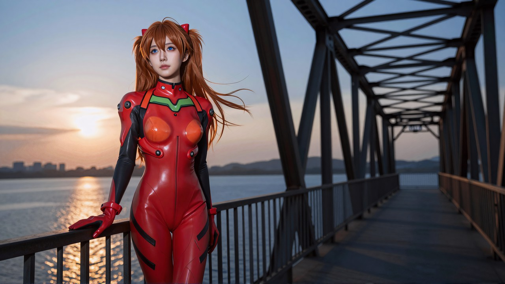

> ⚠️ **这条写在 2026-08-29 归因之前，复用时改这几处**（正文一个字没动，因为上面那张图就是这些字出的）：
> 
> ① `和她的脸／头一样高` —— 那是**镜头的位置**，太阳会被挪到侧后方去。改成 `在她左前方 45 度、比她的脸高一点`（侧前 45°）或 `在她正前方、比她的脸低一截`（正前偏下）。

| 光位 | 光源实体 | 几何线 | 背景 | 补色对 | 黑锚 |
|---|---|---|---|---|---|
| 侧前方 45° | 太阳盘 | 桥架透视 + 海面反光带 | 海 + 天两大块 | 红战斗服 ↔ 深蓝海天 | 铁桥黑钢架 |

`627 字 · 1664x936 · seed 6103 · 中景 · 挂 LoRA`

```
一张 16:9 横幅的真实照片。她在画面左三分之一、从膝盖往上入镜，占画面高度四分之三，右边三分之二让给风景。一位二十出头的亚洲年轻女性 cosplayer，窄长的鹅蛋小脸、下颌角收窄，身材高挑腰细腿长，长相很甜很出挑。她 cosplay 的是《新世纪福音战士》里的明日香，二号机的驾驶员。橙红色的长发披在背后，头顶两侧竖着两枚细长的红色发饰。蓝色的眼瞳，利落的眼线，自然的粉色唇。她穿着一件红色的贴身连体驾驶服，布料是有光泽的，从脖子一直包到手腕，胸口正中是一整块黄绿色的色块，两条手臂整段是黑色的；两边肩膀上各是一枚圆形的硬质护件，腰腹的两侧也各有一枚同样的圆形件。下身是这件红色连体驾驶服的下半截，紧紧贴着腿的线条，膝盖的位置有一圈硬质的护片。两条腿被贴身的红色布料勾出笔直修长的线条。她扶着天桥的钢制栏杆向外探出身，长发被风吹到了身前。眼睛望向远处的湖面，神情是安静的。黄昏的旧铁桥，太阳低低地落在她左前方、和她的脸一样高、斜着照过来，把她半张脸和整个红色的战斗服照成饱满的暖金色，鼻子侧面下方留下一小块三角形的亮斑，另外半张脸落在柔和的暗部里；右边三分之二是向远处收进去的整座铁桥，桥的钢架是黑色的剪影一格一格排下去，桥外是深蓝色的海和天，海面上有一条碎金色的反光带；空气里飘着被夕阳照亮的海雾；画面里最暗的是那些黑色的钢架。真实照片，单反相机拍的 cos 写真，布料有织物纹理，假发有发丝分束，皮肤细腻真实。画面里只有她一个人，没有文字水印。
```

## 11_cos_蕾姆_蓝调雪夜橱窗

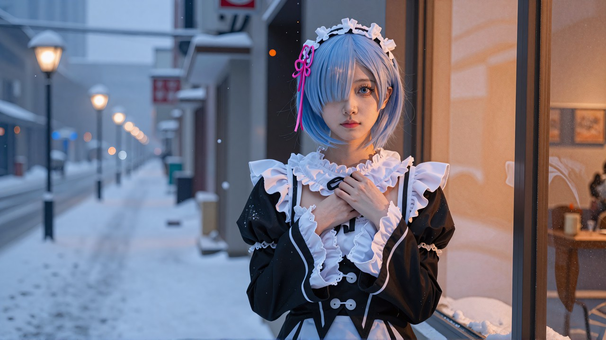

> ⚠️ **这条写在 2026-08-29 归因之前，复用时改这几处**（正文一个字没动，因为上面那张图就是这些字出的）：
> 
> ① `和她的脸／头一样高` —— 那是**镜头的位置**，太阳会被挪到侧后方去。改成 `在她左前方 45 度、比她的脸高一点`（侧前 45°）或 `在她正前方、比她的脸低一截`（正前偏下）。

| 光位 | 光源实体 | 几何线 | 背景 | 补色对 | 黑锚 |
|---|---|---|---|---|---|
| 侧前方（齐脸高橱窗灯箱） | 橱窗暖橘灯箱 | 一排路灯的雪街透视 | 雪街一大块 | 暖橘橱窗 ↔ 冷蓝雪夜 | 黑色女仆裙 + 店铺暗部 |

`634 字 · 1664x936 · seed 6986 · 半身 · 挂 LoRA`

```
一张 16:9 横幅的真实照片。她在画面右三分之一、从腰往上入镜，脸占画面高度三分之一，左边三分之二让给背景。一位二十出头的亚洲年轻女性 cosplayer，窄长的鹅蛋小脸，脸颊平顺内收、下颌角收窄、下巴是尖的，眼距略宽的清澈杏眼，鼻梁直挺，长相很甜很出挑。身材高挑，胸大而饱满，腰肢很细，两条腿又长又直。她 cosplay 的是《Re:从零开始的异世界生活》里的蕾姆，宅邸的女仆。她右边的一缕浅蓝色长发垂下来完全盖住了右眼，只露出左边那只眼睛。其余的浅蓝短发在耳侧收拢，头上戴着一顶白色的荷叶边女仆头饰，左边别着一朵粉紫色的花形发饰。露出的那只眼睛是浅蓝色的、圆而大，睫毛浓密向上卷着，唇是柔和的樱花粉色。她穿着一件黑色的短款女仆连衣裙，肩袖是层层的白色荷叶边，领口镶着一圈白色的蕾丝。她把两只手交叠在围裙的胸口位置，肩膀端得很平。视线平直地落在镜头上，表情是恭敬的。下着雪的蓝调时刻，她站在一家店的橱窗前，橱窗那一整面齐人高的暖橘色灯箱就在她右前方、和她的脸一样高、直直地照着她，把她半张脸照成暖橘色、另外半张落在冷蓝的暗部里，眼睛里有一点暖橘反光；左边三分之二是一条笔直的雪街，一排路灯沿街收到尽头、每盏都在雪里晕开一团光；正在下的雪被橱窗的灯从背后照成漫天飞舞的橘色光点；整条街的雪是很冷的蓝白色；画面里最暗的是她那身黑色的裙子和店铺的暗部。真实照片，单反相机拍的 cos 写真，布料有织物纹理，假发有发丝分束，皮肤细腻真实。画面里只有她一个人，没有文字水印。
```

## 12_写真_亚麻连衣裙·绿荫回廊

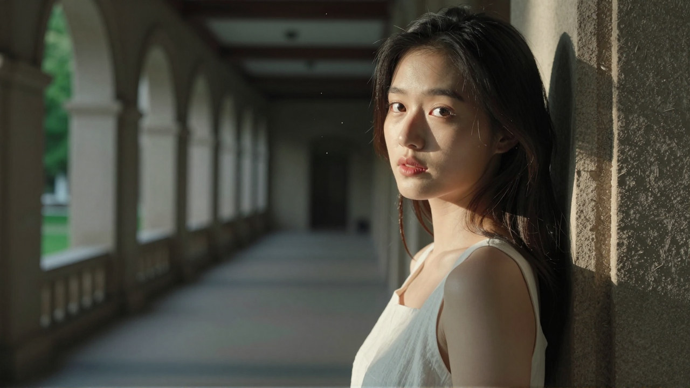

| 景别 | 光位 | 光源实体 | 主光色温 | 成像系统 | 皮肤档 | 几何线 | 补色对 |
|---|---|---|---|---|---|---|---|
| 半身 | 侧前 45° | 一扇拱窗 | 暖白色 | 数码 | 干净 | 一排拱窗排成的透视线 | 暖白光 ↔ 冷青灰石廊 |

`551 字 · 1664x936 · seed 6141 · 不挂 LoRA · 8 步 cfg 1.0`

```
一张 16:9 横幅的真实照片，中长焦 85mm 数码摄影，低饱和，局部高光，暗部干净。她在画面右边三分之一处、从腰往上入镜，左边三分之二让给背景。一位二十出头的亚洲年轻女性，鹅蛋脸小脸，眼距略宽的清澈杏眼、双眼皮褶较窄，眉毛平直偏细，鼻梁直挺、鼻头小巧，下颌线清晰，长相很甜很出挑。她化着干净的裸妆，两边脸颊和鼻梁是和额头、下巴连续的同一片自然肤色，没有腮红。深栗色的长发松松挽在脑后，几缕碎发垂在脸颊边。她穿着一件亚麻白的无袖连衣裙，肩线是方的。她靠在回廊的石柱上侧身站着，转过头看向镜头，眼神很静。盛夏的午后，一道光从她左前方 45 度的拱窗里斜照进来，正好斜劈在她的半张脸上：额头、颧骨和鼻梁被照得发亮，鼻子侧面下方留下一小块三角形的亮斑，另外半张脸整个落在柔和的暗部里，睫毛在被照亮那半边的脸颊上投下细影；她两只眼睛里各有一小点同样大小、同样位置的暖白色反光。左边三分之二是老校舍那条一直收到尽头的拱形回廊，一排拱窗沿着廊子排下去、构成一条贯穿画面的透视线；窗外是一整片被晒亮的绿，廊子深处是画面里唯一的黑。空气里浮着被这道光照亮的细尘。整条回廊是冷青灰的石色，只有这道光和她是暖的。皮肤是自然的缎光质地，T 区高光克制，双颊不湿亮。真实照片。画面里只有她一个人，双手五指完整，没有文字水印。
```

## 13_写真_泳装罩衫·傍晚泳池

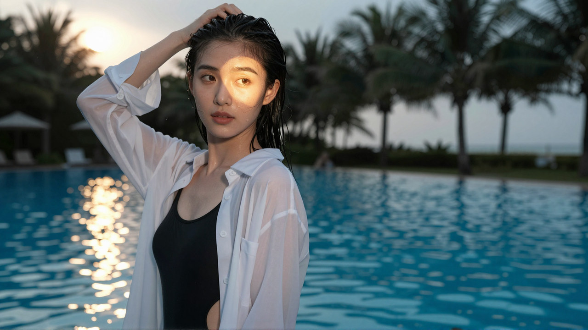

| 景别 | 光位 | 光源实体 | 主光色温 | 成像系统 | 皮肤档 | 几何线 | 补色对 |
|---|---|---|---|---|---|---|---|
| 中景 | 侧前 45° | 太阳（压在棕榈梢上） | 暖金色 | VHS | 纹理 | 海面那条碎金反光带 | 暖金 ↔ 冷青蓝池水 |

`591 字 · 1664x936 · seed 6151 · 不挂 LoRA · 8 步 cfg 1.0`

```
一张 16:9 横幅的真实照片，VHS 录像带质感，明亮低对比，高光整片糊开，泛朦柔光。她站在画面左边三分之一处、从膝盖往上入镜，身高占满画面高度的四分之三，右边三分之二整个让给风景。一位二十出头的亚洲年轻女性，鹅蛋脸小脸，眼距略宽的清澈杏眼、双眼皮褶较窄，眉毛平直偏细，鼻梁直挺、鼻头小巧，下颌线清晰，长相很甜很出挑。她化着干净的裸妆，两边脸颊和鼻梁是和额头、下巴连续的同一片自然肤色，没有腮红。黑色的长发被水打湿了向后梳，发梢还在滴水。她穿着一件黑色的连体泳装，外面松松罩着一件半透明的白色薄纱衬衫。她站在池边侧过身来，一只手把湿掉的头发往后拨，另一只手垂在身侧。傍晚，太阳在她左前方 45 度那排棕榈树梢上压得很低，正好斜劈在她的半张脸上：额头、颧骨和鼻梁被照得发亮，鼻子侧面下方留下一小块三角形的亮斑，另外半张脸整个落在柔和的暗部里，睫毛在被照亮那半边的脸颊上投下细影；她两只眼睛里各有一小点同样大小、同样位置的暖金色反光。右边三分之二是整池发亮的青蓝色水，水面上有一条从太阳一直铺到岸边的碎金反光带、笔直地穿过整个画面；那排棕榈压成纯黑的剪影。空气里浮着被这道光照亮的水雾。池水和天顶是大片的冷青蓝，只有这道光和她是暖的。她保留着真实的皮肤纹理和自然的毛孔，底妆是半哑光的，鼻梁上只留一条窄高光，水润只保留在唇部。真实照片。画面里只有她一个人，双手五指完整，没有文字水印。
```

## 14_写真_JK 制服·黄昏站台

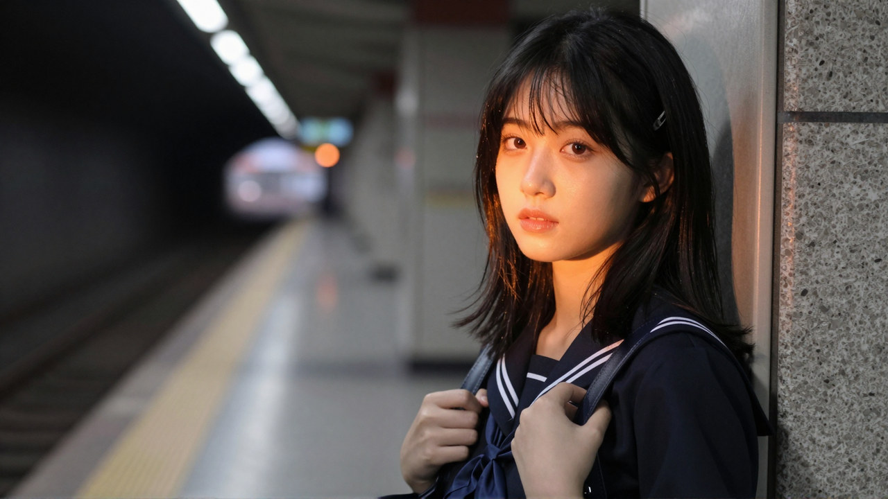

| 景别 | 光位 | 光源实体 | 主光色温 | 成像系统 | 皮肤档 | 几何线 | 补色对 |
|---|---|---|---|---|---|---|---|
| 半身 | 正前偏下 | 站台边沿的灯带 | 暖橘色 | 数码 | 干净 | 站台边沿那条灯带 | 暖橘灯带 ↔ 冷白瓷砖 |

`546 字 · 1664x936 · seed 6141 · 不挂 LoRA · 8 步 cfg 1.0`

```
一张 16:9 横幅的真实照片，中长焦 85mm 数码摄影，低饱和，局部高光，暗部干净。她在画面右边三分之一处、从腰往上入镜，左边三分之二让给背景。一位二十出头的亚洲年轻女性，鹅蛋脸小脸，眼距略宽的清澈杏眼、双眼皮褶较窄，眉毛平直偏细，鼻梁直挺、鼻头小巧，下颌线清晰，长相很甜很出挑。她化着干净的裸妆，两边脸颊和鼻梁是和额头、下巴连续的同一片自然肤色，没有腮红。黑色的中长发垂到肩下，鬓边别着一枚素色发卡。她穿着深蓝色的水手服上衣，领口系着一条藏青色的丝带。她背靠着站台的立柱站着，两只手拎着书包带垂在身前，转过头看向镜头。黄昏的地铁站台，一整条暖橘色的灯带就嵌在她正前方、比她的脸低一截的站台边沿上，直直地照上来，把她的下巴、颧骨、鼻梁和额头照得发亮，鼻子侧面下方留下一小块三角形的亮斑，另外半张脸落在柔和的暗部里，睫毛在被照亮那半边的脸颊上投下细影；她两只眼睛里各有一小点同样大小、同样位置的暖橘色反光。左边三分之二是那条一直收到隧道口的站台，站台边沿那条笔直的灯带贯穿整个画面；隧道口是画面里唯一的黑。空气里浮着被灯带照亮的细尘。整座站台的瓷砖是冷白的，只有这条灯带和她是暖的。皮肤是自然的缎光质地，T 区高光克制，双颊不湿亮。真实照片。画面里只有她一个人，双手五指完整，没有文字水印。
```

## 15_写真_运动套装·夜球场

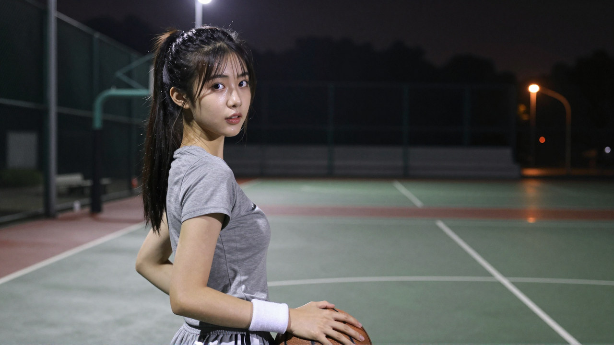

| 景别 | 光位 | 光源实体 | 主光色温 | 成像系统 | 皮肤档 | 几何线 | 补色对 |
|---|---|---|---|---|---|---|---|
| 中景 | 正前偏下 | 一盏很矮的泛光灯 | 冷白色 | 数码 | 干净 | 球场的白色边线 | 冷白场地 ↔ 远处暖橘路灯 |

`559 字 · 1664x936 · seed 6161 · 不挂 LoRA · 8 步 cfg 1.0`

```
一张 16:9 横幅的真实照片，中长焦 85mm 数码摄影，低饱和，局部高光，暗部干净。她站在画面左边三分之一处、从膝盖往上入镜，身高占满画面高度的四分之三，右边三分之二整个让给风景。一位二十出头的亚洲年轻女性，鹅蛋脸小脸，眼距略宽的清澈杏眼、双眼皮褶较窄，眉毛平直偏细，鼻梁直挺、鼻头小巧，下颌线清晰，长相很甜很出挑。她化着干净的裸妆，两边脸颊和鼻梁是和额头、下巴连续的同一片自然肤色，没有腮红。黑色的长发扎成一个高马尾。她穿着一套灰色的运动短袖和短裤，手腕上戴着一条白色护腕。她站在球场中线上侧身回头看向镜头，一只手抱着篮球搭在腰侧。深夜的室外球场，一盏很矮的泛光灯就架在她正前方、比她的脸低很多的场边，直直地照上来，把她的下巴、颧骨、鼻梁和额头照得发亮，鼻子侧面下方留下一小块三角形的亮斑，另外半张脸落在柔和的暗部里，睫毛在被照亮那半边的脸颊上投下细影；她两只眼睛里各有一小点同样大小、同样位置的冷白色反光。右边三分之二是整片空着的球场，地上那几条笔直的白色边线一路收到底线、构成一条贯穿画面的透视线；场外的看台是画面里唯一的黑。空气里浮着被泛光灯照亮的夜露。远处一排路灯是暖橘的，压在整片冷白的场地上。皮肤是自然的缎光质地，T 区高光克制，双颊不湿亮。真实照片。画面里只有她一个人，双手五指完整，没有文字水印。
```

## 16_写真_皮夹克·深夜电玩城

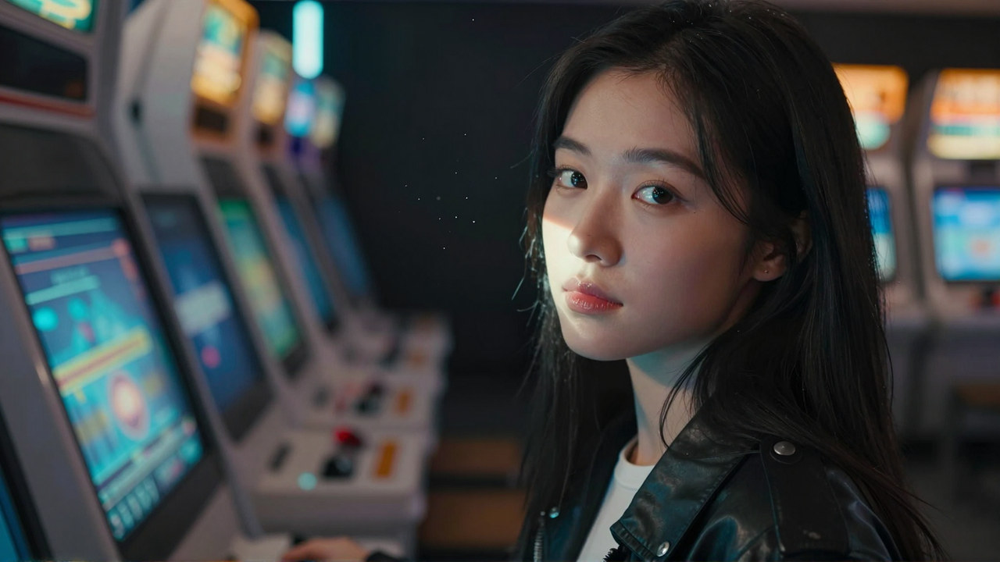

| 景别 | 光位 | 光源实体 | 主光色温 | 成像系统 | 皮肤档 | 几何线 | 补色对 |
|---|---|---|---|---|---|---|---|
| 近景 | 侧前 45° | 一整面街机屏幕 | 青蓝色 | VHS | 纹理 | 街机顶沿那条边线 | 青蓝屏光 ↔ 暖橘兑币灯牌 |

`579 字 · 1664x936 · seed 6141 · 不挂 LoRA · 8 步 cfg 1.0`

```
一张 16:9 横幅的真实照片，VHS 录像带质感，明亮低对比，高光整片糊开，泛朦柔光。她在画面右边三分之一处、从胸口往上入镜，脸占画面高度的三分之一，左边三分之二让给背景。一位二十出头的亚洲年轻女性，鹅蛋脸小脸，眼距略宽的清澈杏眼、双眼皮褶较窄，眉毛平直偏细，鼻梁直挺、鼻头小巧，下颌线清晰，长相很甜很出挑。她化着干净的裸妆，两边脸颊和鼻梁是和额头、下巴连续的同一片自然肤色，没有腮红。黑色的长直发披下来，几缕贴在脸颊边。她穿着一件黑色的皮夹克，里面是一件白色的圆领上衣。她侧身靠在一台街机上，转过头看向镜头，下巴微微抬起来。深夜的电玩城，一整面街机屏幕的青蓝色光在她左前方 45 度、和她的肩膀差不多高地斜照过来，正好斜劈在她的半张脸上：额头、颧骨和鼻梁被照得发亮，鼻子侧面下方留下一小块三角形的亮斑，另外半张脸整个落在柔和的暗部里，睫毛在被照亮那半边的脸颊上投下细影；她两只眼睛里各有一小点同样大小、同样位置的青蓝色反光。左边三分之二是一整排一直排到深处的街机，机身顶沿那条笔直的边线贯穿整个画面；过道深处在两米外衰减成纯黑。空气里浮着被屏光照亮的浮尘。她身后一块暖橘的兑币灯牌是整张照片里唯一的暖色。她保留着真实的皮肤纹理和自然的毛孔，底妆是半哑光的，鼻梁上只留一条窄高光，水润只保留在唇部。真实照片。画面里只有她一个人，双手五指完整，没有文字水印。
```

## 17_写真_丝质吊带·深夜阳台

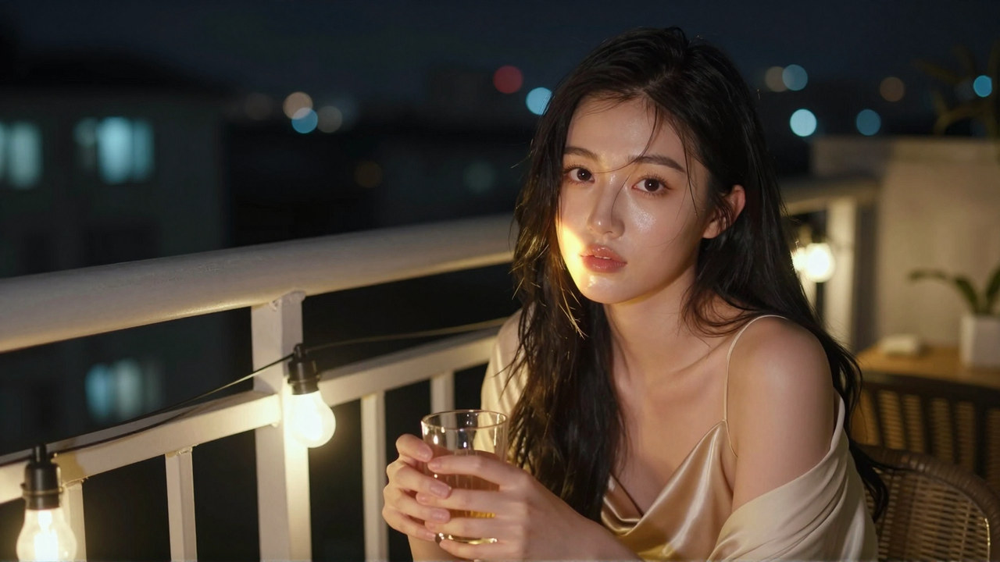

| 景别 | 光位 | 光源实体 | 主光色温 | 成像系统 | 皮肤档 | 几何线 | 补色对 |
|---|---|---|---|---|---|---|---|
| 近景 | 正前偏下 | 栏杆上一串小灯泡 | 暖黄色 | 柔雾 | 干净 | 栏杆顶沿那条横线 | 暖黄灯串 ↔ 冷蓝城市窗火 |

`586 字 · 1664x936 · seed 6141 · 不挂 LoRA · 8 步 cfg 1.0`

```
一张 16:9 横幅的真实照片，Pro-Mist 柔雾滤镜，低对比，亮部化开，高光边缘带一圈奶油色的晕。她在画面右边三分之一处、从胸口往上入镜，脸占画面高度的三分之一，左边三分之二让给背景。一位二十出头的亚洲年轻女性，鹅蛋脸小脸，眼距略宽的清澈杏眼、双眼皮褶较窄，眉毛平直偏细，鼻梁直挺、鼻头小巧，下颌线清晰，长相很甜很出挑。她化着干净的裸妆，两边脸颊和鼻梁是和额头、下巴连续的同一片自然肤色，没有腮红。黑色的长发垂到腰下，中分，几绺被夜风吹到颊边。她穿着一件香槟色的丝质吊带，肩上松松搭着一条同色的薄披肩。她坐在阳台的藤椅上俯身向前，两只手捧着一只玻璃杯搭在膝上，抬起眼看向镜头。夏天的深夜，一串暖黄的小灯泡就挂在她正前方、比她的脸低半米的栏杆上，直直地照上来，把她的下巴、颧骨、鼻梁和额头照得发亮，鼻子侧面下方留下一小块三角形的亮斑，另外半张脸落在柔和的暗部里，睫毛在被照亮那半边的脸颊上投下细影；她两只眼睛里各有一小点同样大小、同样位置的暖黄色反光。左边三分之二是栏杆外整片城市的窗火，栏杆顶沿那条横线把画面分成上下两块；阳台顶棚的暗部是画面里唯一的黑。空气里浮着白天晒起来、还没散尽的热气，被这串灯整片照透。身后整片城市窗火是冷蓝的，只有这串灯和她是暖的。皮肤是自然的缎光质地，T 区高光克制，双颊不湿亮。真实照片。画面里只有她一个人，双手五指完整，没有文字水印。
```

## 18_写真_风衣·雨后石桥

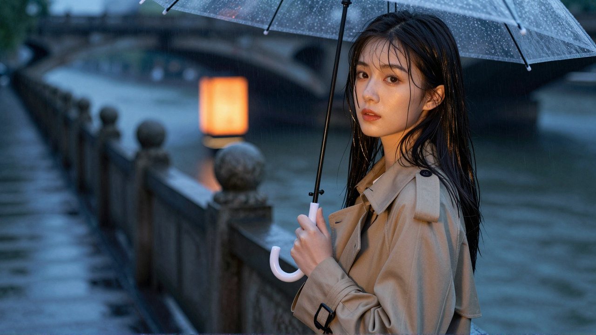

| 景别 | 光位 | 光源实体 | 主光色温 | 成像系统 | 皮肤档 | 几何线 | 补色对 |
|---|---|---|---|---|---|---|---|
| 半身 | 正前偏下 | 对岸一块齐胸高的灯箱 | 暖橘色 | VHS | 纹理 | 石桥栏杆的透视 | 暖橘灯箱 ↔ 冷蓝河面 |

`561 字 · 1664x936 · seed 6161 · 不挂 LoRA · 8 步 cfg 1.0`

```
一张 16:9 横幅的真实照片，VHS 录像带质感，明亮低对比，高光整片糊开，泛朦柔光。她在画面右边三分之一处、从腰往上入镜，左边三分之二让给背景。一位二十出头的亚洲年轻女性，鹅蛋脸小脸，眼距略宽的清澈杏眼、双眼皮褶较窄，眉毛平直偏细，鼻梁直挺、鼻头小巧，下颌线清晰，长相很甜很出挑。她化着干净的裸妆，两边脸颊和鼻梁是和额头、下巴连续的同一片自然肤色，没有腮红。黑色的长直发被雨打湿了一点，几缕贴在脸颊边。她穿着一件米色的长风衣，腰带松松系着，手里拎着一把收起来的透明伞。她靠在石桥的栏杆上侧身站着，转过头看向镜头。雨刚停的深夜，对岸一块齐胸高的暖橘色灯箱正对着她、比她的脸低一截，直直地照上来，把她的下巴、颧骨、鼻梁和额头照得发亮，鼻子侧面下方留下一小块三角形的亮斑，另外半张脸落在柔和的暗部里，睫毛在被照亮那半边的脸颊上投下细影；她两只眼睛里各有一小点同样大小、同样位置的暖橘色反光。左边三分之二是那条笔直的石桥栏杆一路收到对岸，栏杆的立柱一根一根排下去；桥洞底下是画面里唯一的黑。空气里还飘着被灯箱照亮的细雨丝。整条河面和湿亮的桥面是冷蓝的，只有这块灯箱和她是暖的。她保留着真实的皮肤纹理和自然的毛孔，底妆是半哑光的，鼻梁上只留一条窄高光，水润只保留在唇部。真实照片。画面里只有她一个人，双手五指完整，没有文字水印。
```

## 19_写真_马面裙·夜里的茶楼

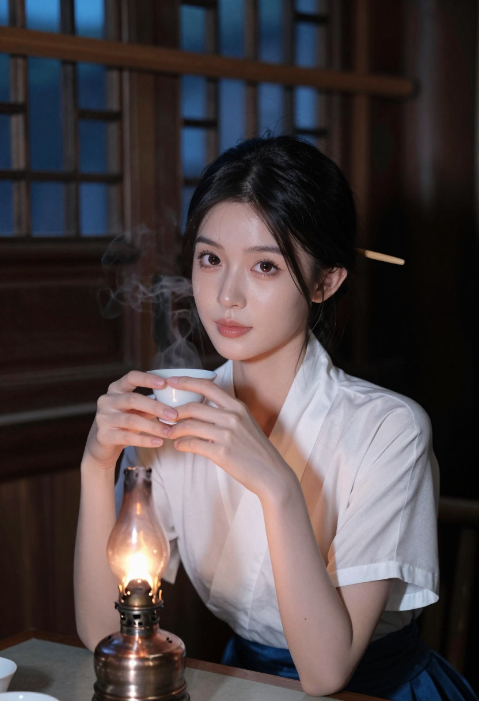

| 景别 | 光位 | 光源实体 | 主光色温 | 成像系统 | 皮肤档 | 几何线 | 补色对 |
|---|---|---|---|---|---|---|---|
| 半身 | 正前偏下 | 桌上一盏矮铜油灯 | 暖橘色 | 数码 | 干净 | 木格门扇的横楣 | 暖橘油灯 ↔ 窗外冷靛蓝 |

`533 字 · 832x1216 · seed 6141 · 不挂 LoRA · 8 步 cfg 1.0`

```
一张竖幅 2:3 的真实照片，中长焦 85mm 数码摄影，低饱和，局部高光，暗部干净。她在画面中心偏右、从腰往上入镜。一位二十出头的亚洲年轻女性，鹅蛋脸小脸，眼距略宽的清澈杏眼、双眼皮褶较窄，眉毛平直偏细，鼻梁直挺、鼻头小巧，下颌线清晰，长相很甜很出挑。她化着干净的裸妆，两边脸颊和鼻梁是和额头、下巴连续的同一片自然肤色，没有腮红。黑色的长发在脑后松松挽起，一支素色的木簪横插着。她穿着一件月白色的短上襦，下面是一条藏蓝色的马面裙。她坐在窗边的方桌前，两只手拢着一只白瓷茶杯，抬起眼看向镜头。夜里的老茶楼，一盏矮矮的铜油灯就摆在她正前方、比她的脸低半米的桌面上，直直地照上来，把她的下巴、颧骨、鼻梁和额头照得发亮，鼻子侧面下方留下一小块三角形的亮斑，另外半张脸落在柔和的暗部里，睫毛在被照亮那半边的脸颊上投下细影；她两只眼睛里各有一小点同样大小、同样位置的暖橘色反光。她身后整片是虚化开的深色木格门扇，门扇上那条笔直的横楣穿过画面上方；屋子深处糊成一片没有细节的纯黑。空气里浮着被这盏灯照亮的茶汽。窗外透进来的夜色是冷靛蓝的，只有这盏油灯和她是暖的。皮肤是自然的缎光质地，T 区高光克制，双颊不湿亮。真实照片，浅景深。画面里只有她一个人，双手五指完整，没有文字水印。
```

## 20_写真_机能夹克·自动贩卖机

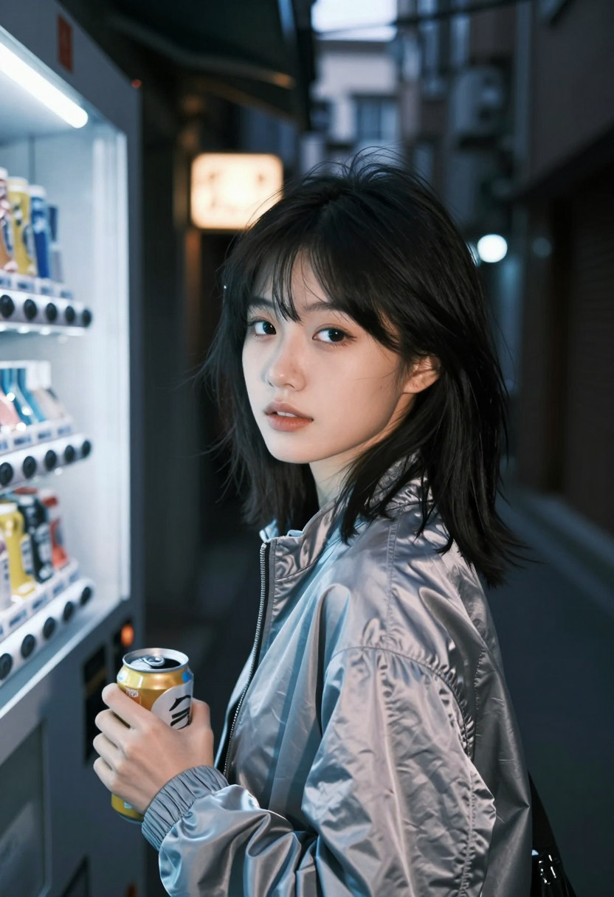

| 景别 | 光位 | 光源实体 | 主光色温 | 成像系统 | 皮肤档 | 几何线 | 补色对 |
|---|---|---|---|---|---|---|---|
| 半身 | 侧前 45° | 一整台自动贩卖机 | 青蓝色 | 数码 | 纹理 | 两栋楼之间那道天缝 | 青蓝屏光 ↔ 巷口暖橘灯牌 |

`588 字 · 832x1216 · seed 6141 · 不挂 LoRA · 8 步 cfg 1.0`

```
一张竖幅 2:3 的真实照片，中长焦 85mm 数码摄影，低饱和，局部高光，暗部干净。她在画面中心偏右、从腰往上入镜。一位二十出头的亚洲年轻女性，鹅蛋脸小脸，眼距略宽的清澈杏眼、双眼皮褶较窄，眉毛平直偏细，鼻梁直挺、鼻头小巧，下颌线清晰，长相很甜很出挑。她化着干净的裸妆，两边脸颊和鼻梁是和额头、下巴连续的同一片自然肤色，没有腮红。黑色的中长发被夜风吹到一侧，几缕贴在颊边。她穿着一件银灰色的反光机能夹克，立领拉到下巴，袖口收得很紧。她背靠着贩卖机站着，一只手拎着一罐还没开的饮料，转过头看向镜头。深夜的小巷，一整台自动贩卖机在她左前方 45 度、和她的肩膀差不多高地亮着青蓝色的光，正好斜劈在她的半张脸上：额头、颧骨和鼻梁被照得发亮，鼻子侧面下方留下一小块三角形的亮斑，另外半张脸整个落在柔和的暗部里，睫毛在被照亮那半边的脸颊上投下细影；她两只眼睛里各有一小点同样大小、同样位置的青蓝色反光。她身后是一条一直收到街尾的窄巷，两边楼房之间那道笔直的天缝从画面顶边落下来；巷子深处在几米外就衰减成纯黑。空气里浮着被贩卖机的光照亮的夜雾。巷口一块暖橘色的拉面店灯牌在她身后远处亮着，是整张照片里唯一的暖色，占画面很小一角。她保留着真实的皮肤纹理和自然的毛孔，底妆是半哑光的，鼻梁上只留一条窄高光，水润只保留在唇部。真实照片，浅景深。画面里只有她一个人，双手五指完整，没有文字水印。
```

## 21_写真_条纹针织·深夜电话亭

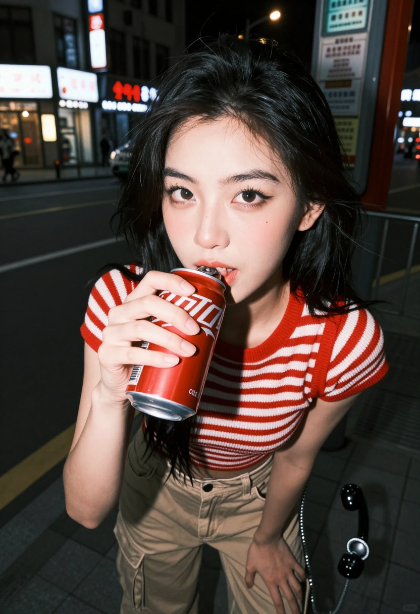

| 成立点 | 风格入口 | 成像系统 | 机位 | 主光 | 皮肤档 |
|---|---|---|---|---|---|
| 场景关系 + 成像方式 | Y2K猫系街头 | CCD 直闪 | 近距离广角轻俯拍 | 机顶直闪（正面近距离） | 纹理 |

`552 字 · 832x1216 · seed 6151 · 不挂 LoRA · 8 步 cfg 1.0`

```
9:16，CCD direct flash 数码卡片机，Y2K 猫系街头写真，元气甜酷，高反差硬光，人物边缘轻微过曝。
一位二十出头的亚洲年轻女性，窄长的鹅蛋小脸，眼距略宽的清澈杏眼，猫眼眼线，唇是水润的橘粉色，自然半哑光底妆，保留真实的皮肤纹理和自然毛孔。两边脸颊和鼻梁是和额头、下巴连续的同一片自然肤色，没有腮红。黑色的中长发蓬松地披着，被夜风吹乱了几绺。
【穿搭】：她穿着一件红白条纹的短款针织上衣，下面是一条卡其色的工装裤，裤脚堆在鞋面上。
【场景】：深夜的街角，路面刚洒过水，隔着马路是一整排还亮着的店招，空气是夏夜的闷热。
【道具元素】：一座旧式电话亭 / 一罐已经开了的汽水 / 电话听筒 / 一枚发圈 / 前景的玻璃反光（道具根据实际构图需求选取，不要将所有的道具全都塞进一个画面中）
【镜头角度】：近距离广角轻俯拍，朋友突然按下快门的那种视角。
【构图】：人物占画面上方三分之二，身体略微前倾贴近镜头，广角带来轻微畸变，背景轻微虚化。
【动作与表情】：她咬着汽水罐的拉环，眉毛一挑，眼睛斜着瞟向镜头，像刚被人喊了一声。
【光线与质感】：机顶直闪从正面近距离打过来，落在她的眼神、鼻梁窄线、唇部和针织的绒面上，形成局部高光和轻微过曝的边缘；额头大面和双颊保持柔和漫反射，背景快速衰减变暗。
```

## 22_写真_豹纹衬衫·复古沙发

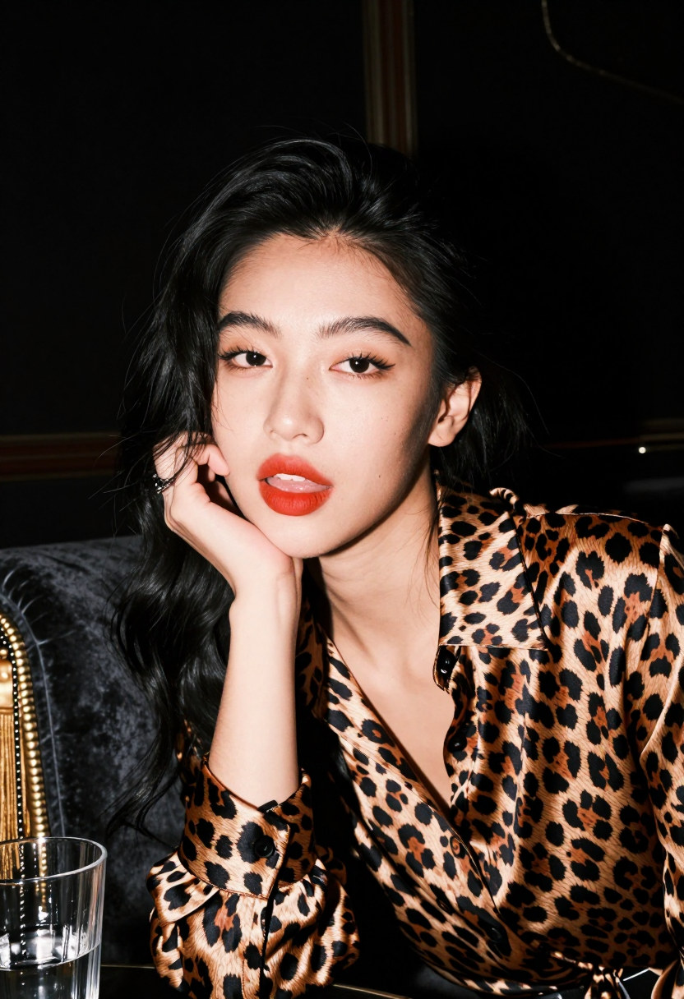

| 成立点 | 风格入口 | 成像系统 | 机位 | 主光 | 皮肤档 |
|---|---|---|---|---|---|
| 妆面 + 成像方式 | 豹纹复古直闪 | 机顶直闪 | 近距离直闪特写 | 机顶直闪（正面） | 纹理 |

`546 字 · 832x1216 · seed 6161 · 不挂 LoRA · 8 步 cfg 1.0`

```
9:16，direct flash 机顶直闪，夜室内低照度奢华暗调写真，背景压黑，金属与豹纹反光。
一位二十出头的亚洲年轻女性，窄长的鹅蛋小脸，上挑的细眼线，唇是哑光的正红色，自然半哑光底妆，保留真实的皮肤纹理、自然毛孔和细小绒毛。两边脸颊和鼻梁是和额头、下巴连续的同一片自然肤色，没有腮红。黑色的长发被拨到一侧肩前，发梢是很松的大波浪。
【穿搭】：她穿着一件豹纹的真丝质地宽松上衣，领口松松敞开两颗扣子，袖口挽到小臂。
【场景】：夜里的室内，只有很低的环境亮度，空间深处整个沉下去，是上个年代的装潢气质。
【道具元素】：一张深色天鹅绒沙发 / 一只窄口玻璃杯 / 一条金属细链 / 沙发扶手上的流苏 / 一枚戒指（道具根据实际构图需求选取，不要将所有的道具全都塞进一个画面中）
【镜头角度】：近距离直闪特写，镜头几乎凑到她面前，被观察感很强。
【构图】：人物占满画面，脸略偏右，左边留一小块沙发靠背的暗部，大胆裁切掉一侧肩膀，浅景深。
【动作与表情】：她一只手托着下巴撑在沙发背上，冲镜头吐了一下舌尖，眼睛弯起来。
【光线与质感】：机顶直闪正面打上去，落在她的唇部、鼻梁、锁骨和豹纹真丝的高光上，形成硬闪的局部过曝；背景在半米外迅速衰减成纯黑，真丝的反光是成片的，皮肤只在 T 区留窄高光。
```

## 23_写真_橘色背心·夏日防波堤

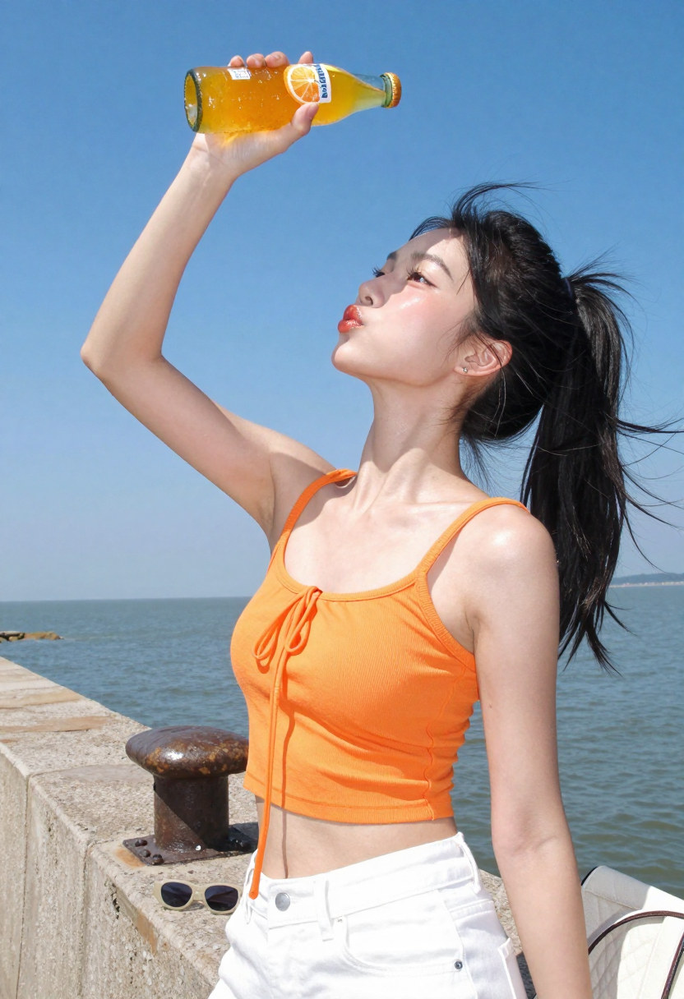

| 成立点 | 风格入口 | 成像系统 | 机位 | 主光 | 皮肤档 |
|---|---|---|---|---|---|
| 场景 + 镜头 | 橘子汽水海边 | CCD 卡片机 | 低机位广角 | 正午偏后的硬日光（斜上方） | 干净偏缎光 |

`531 字 · 832x1216 · seed 6161 · 不挂 LoRA · 8 步 cfg 1.0`

```
9:16，CCD 数码卡片机，夏日海边 Y2K 度假写真，蓝天高饱和，柔焦泛白，明亮通透。
一位二十出头的亚洲年轻女性，窄长的鹅蛋小脸，清澈杏眼，几乎看不出眼妆，唇是水润的橘色，自然缎光底妆，保留真实的皮肤纹理。两边脸颊和鼻梁是和额头、下巴连续的同一片自然肤色，没有腮红。黑色的长发扎成高马尾，被海风整片吹起来。
【穿搭】：她穿着一件橘色的短款抽绳上衣，下摆用一根抽绳收在胸口下方，下面是一条白色的高腰短裤。
【场景】：盛夏正午过后的防波堤，海面在堤外一路铺开，天是高饱和的蓝，晒得人发烫。
【道具元素】：一瓶还挂着水珠的橘子汽水 / 一副塑料太阳镜 / 堤上的一根铁制系缆桩 / 一只帆布包（道具根据实际构图需求选取，不要将所有的道具全都塞进一个画面中）
【镜头角度】：低机位广角，镜头几乎贴着堤面往上拍，人物顶天。
【构图】：人物在画面中心偏右、占画面高度的四分之三，堤面的斜线从画面左下角切进来，天空占上半部。
【动作与表情】：她把汽水瓶高高举过头顶，仰着脸鼓起两颊，像是要把最后一口喝完。
【光线与质感】：正午偏后的硬日光从斜上方落下来，落在她的肩线、锁骨、手臂和汽水瓶的玻璃上，形成硬阴影切割和玻璃上的一点高光爆点；海面把光反回来给下颌和颈侧一层补光。
```

## 24_写真_花衬衫·热带旅馆


| 成立点 | 风格入口 | 成像系统 | 机位 | 主光 | 皮肤档 |
|---|---|---|---|---|---|
| 成像方式 + 场景 | 热带 VHS travelogue | VHS | 手机近距离抓拍感 | 院子的强反射光（走廊敞开一侧整片涌入） | 纹理 |

`569 字 · 832x1216 · seed 6141 · 不挂 LoRA · 8 步 cfg 1.0`

> ⚠️ 这条出自加「亚洲」锚点**之前**的那一批，人物句是 `成年年轻女性`。**复用时把它改成 `一位二十出头的亚洲年轻女性`** —— 同种子单变量对照证实这两个字只拉脸、不动画面（v12/v13 对照）。

```
9:16，overexposed tropical VHS travelogue，热带旅行录像感，blown highlights，泛朦柔光，明亮低对比。
成年年轻女性，窄长的鹅蛋小脸，清澈杏眼，眼妆很淡，唇是自然的裸粉色，自然半哑光底妆，保留真实的皮肤纹理和自然毛孔。两边脸颊和鼻梁是和额头、下巴连续的同一片自然肤色，没有腮红。黑色的中长发被湿热的空气吹得有点毛躁，几绺贴在颈边。
【穿搭】：她穿着一件宽松的热带印花短袖衬衫，下摆在腰侧打了个结。
【场景】：午后的热带旅馆外廊，一侧是通到底的敞开式走廊，另一侧是被晒白的院子，空气又湿又亮。
【道具元素】：一台旧式录像机 / 一只藤编行李箱 / 廊柱旁的一丛龟背竹 / 一杯插着吸管的椰子（道具根据实际构图需求选取，不要将所有的道具全都塞进一个画面中）
【镜头角度】：手机近距离抓拍感，同行的人边走边随手举起来拍的那种角度。
【构图】：人物在画面偏左，走廊的透视从她身后一路收进去，右侧大胆裁切掉半根廊柱，画面有轻微运动虚焦。
【动作与表情】：她一边往前走一边抬手挡了一下光，眯着两只眼睛笑起来，另一只手拎着椰子。
【光线与质感】：院子里的强反射光从走廊敞开的一侧整片涌进来，落在她的额头、手背、衬衫的印花和廊柱上，形成大面积的高光溢出和泛白；整体是录像带那种明亮低对比，高光边缘化开。
```

## 25_写真_斜襟短衫·旧木室内

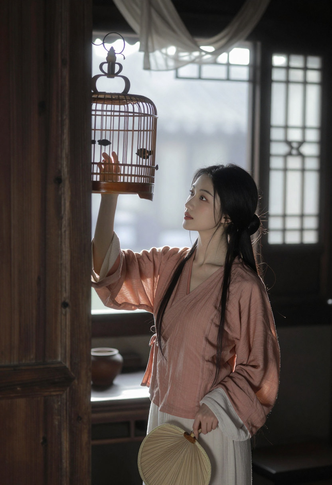

| 成立点 | 风格入口 | 成像系统 | 机位 | 主光 | 皮肤档 |
|---|---|---|---|---|---|
| 场景 + 光线 | 古风旧室鸟笼 | 尼康 + film halation | 门框窥视 | 窗外白雾逆光（正后方整片透进来） | 纹理 |

`534 字 · 832x1216 · seed 6141 · 不挂 LoRA · 8 步 cfg 1.0`

> ⚠️ 这条出自加「亚洲」锚点**之前**的那一批，人物句是 `成年年轻女性`。**复用时把它改成 `一位二十出头的亚洲年轻女性`** —— 同种子单变量对照证实这两个字只拉脸、不动画面（v12/v13 对照）。

```
9:16，尼康相机摄影，古风旧室写真，窗外白雾逆光，film halation，旧镜头低对比。
成年年轻女性，窄长的鹅蛋小脸，清澈杏眼，眼妆几乎看不出，唇是自然的豆沙色，自然半哑光底妆，保留真实的皮肤纹理。两边脸颊和鼻梁是和额头、下巴连续的同一片自然肤色，没有腮红。黑色的长发在脑后松松挽起，鬓边垂下两绺碎发。
【穿搭】：她穿着一件藕色的斜襟短衫，袖口宽阔，衣料是有垂坠感的薄棉。
【场景】：旧木结构的室内，午后，窗外是一整片白雾，屋里的木头都发着暗，时代感是上个世纪的。
【道具元素】：一只竹编鸟笼 / 一把旧团扇 / 案上一只粗陶盏 / 窗棂 / 前景垂下来的一角纱帘（道具根据实际构图需求选取，不要将所有的道具全都塞进一个画面中）
【镜头角度】：门框窥视，镜头藏在半开的木门后面往里看，像不小心撞见的一瞬间。
【构图】：画面四边被门框切成框中框，人物在框内偏右、从腰往上入镜，左侧的门板占掉画面三分之一。
【动作与表情】：她抬手逗了一下鸟笼里的东西，低着头偷偷笑起来，没有看镜头。
【光线与质感】：窗外的白雾逆光从她身后整片透进来，落在她的发丝外圈、袖口的薄棉和鸟笼的竹条上，形成 halation 一样化开的高光和旧镜头特有的低对比；屋内的木色整片压在暗调里。
```

## 26_写真_棉布上衣·雏菊花丛

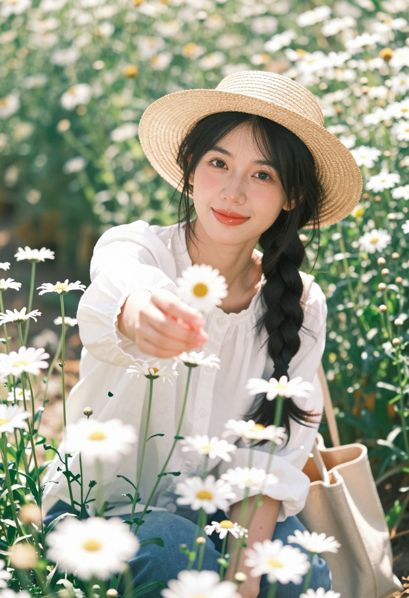

| 成立点 | 风格入口 | 成像系统 | 机位 | 主光 | 皮肤档 |
|---|---|---|---|---|---|
| 场景 + 镜头 | 雏菊花丛富士 | 富士 | 昆虫视角 | 穿过花丛的午后日光（斑驳光斑） | 纹理（带细小绒毛） |

`513 字 · 832x1216 · seed 6141 · 不挂 LoRA · 8 步 cfg 1.0`

> ⚠️ 这条出自加「亚洲」锚点**之前**的那一批，人物句是 `成年年轻女性`。**复用时把它改成 `一位二十出头的亚洲年轻女性`** —— 同种子单变量对照证实这两个字只拉脸、不动画面（v12/v13 对照）。

```
9:16，户外富士相机摄影，夏日花丛写真，通透明亮，前景柔焦，轻微色偏。
成年年轻女性，窄长的鹅蛋小脸，清澈杏眼，眼妆很淡，唇是水润的樱粉色，自然缎光底妆，保留真实的皮肤纹理和细小绒毛。两边脸颊和鼻梁是和额头、下巴连续的同一片自然肤色，没有腮红。黑色的长发松松编成一条辫子垂在肩前，几缕碎发飞起来。
【穿搭】：她穿着一件白色的棉布衬衫式上衣，袖子挽到手肘，下摆宽松地垂下来。
【场景】：夏日午后的雏菊花丛，花开到齐腰高，一直铺到看不见边，风一阵一阵地过。
【道具元素】：一朵刚摘下来的雏菊 / 一顶宽檐草帽 / 一只旧帆布挎包 / 前景一整片虚化的花瓣（道具根据实际构图需求选取，不要将所有的道具全都塞进一个画面中）
【镜头角度】：昆虫视角，镜头压到花丛里面、从两株花的缝隙往上看她。
【构图】：前景整片被虚化的花瓣和茎叶遮住下半幅，人物从缝隙里露出上半身、在画面中心偏左，浅景深。
【动作与表情】：她伸手拨开面前的一丛花，把一朵雏菊递向镜头，看着画外的什么东西偷偷笑。
【光线与质感】：午后的日光穿过花丛落下来，落在她的手背、袖口、发梢和前景的花瓣上，形成斑驳的光斑和前景花瓣的透光边缘；富士的色彩让绿和白之间有轻微的色偏。
```

## 27_写真_格纹衬衫·青苹果果园

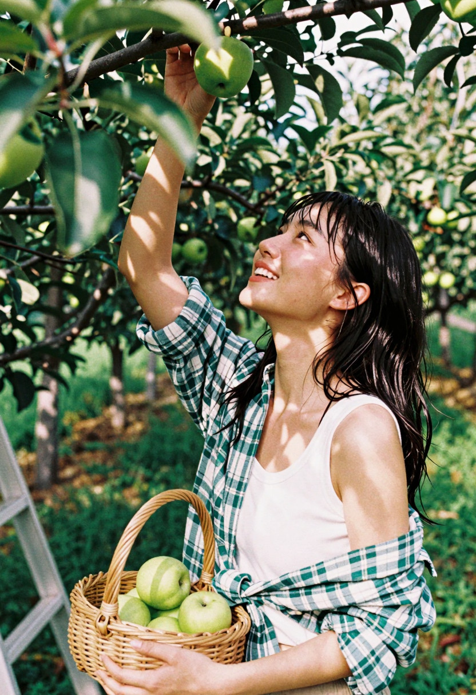

| 成立点 | 风格入口 | 成像系统 | 机位 | 主光 | 皮肤档 |
|---|---|---|---|---|---|
| 场景 + 镜头 | 夏日果园 35mm | 35mm 胶片 | 藏在枝叶后面的镜头感 | 树冠漏光（斑驳 + 地面绿反射） | 纹理（毛孔 + 细碎光影） |

`548 字 · 832x1216 · seed 6141 · 不挂 LoRA · 8 步 cfg 1.0`

> ⚠️ 这条出自加「亚洲」锚点**之前**的那一批，人物句是 `成年年轻女性`。**复用时把它改成 `一位二十出头的亚洲年轻女性`** —— 同种子单变量对照证实这两个字只拉脸、不动画面（v12/v13 对照）。

```
9:16，35mm film photography 真实胶片摄影，夏日果园抓拍，自然颗粒，绿色反射光，低对比。
成年年轻女性，窄长的鹅蛋小脸，清澈杏眼，几乎看不出妆，唇是自然的裸色，自然半哑光底妆，保留真实的皮肤纹理、自然毛孔和细碎的光影。两边脸颊和鼻梁是和额头、下巴连续的同一片自然肤色，没有腮红。黑色的长发随意披着，发梢有点被汗打湿。
【穿搭】：她穿着一件白色的背心，外面松松系着一件绿格纹衬衫，衬衫的两只袖子在腰前打了个结。
【场景】：夏日的果园，一行一行的果树把天空切成条，树下是没修过的草，闷热里有果子的味道。
【道具元素】：几颗还青着的苹果 / 一只藤编果篮 / 一把梯子的一角 / 前景垂下来的枝叶（道具根据实际构图需求选取，不要将所有的道具全都塞进一个画面中）
【镜头角度】：藏在枝叶后面的镜头感，隔着一层树枝远远拍过去，像没被发现。
【构图】：前景被枝叶遮掉画面的左上角和右侧，人物在中间偏右、从胸口往上，背景是一层层收进去的果树。
【动作与表情】：她踮脚去够头顶的一颗果子，张着嘴笑出来，另一只手抱着果篮。
【光线与质感】：树冠的漏光落在她的脸颊、锁骨、手臂和青苹果的果皮上，形成斑驳的光斑和硬阴影；地面的草把绿色反射回来，给她的下颌和颈侧一层淡淡的绿。胶片的自然颗粒明显。
```

## 28_写真_华夫格家居服·欧式卧室

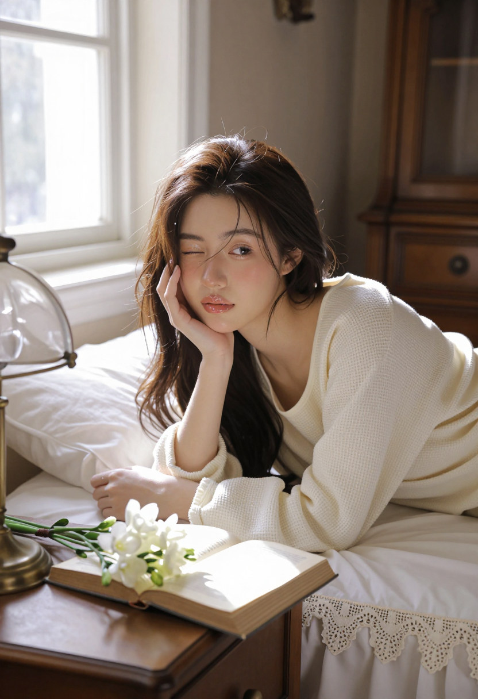

| 成立点 | 风格入口 | 成像系统 | 机位 | 主光 | 皮肤档 |
|---|---|---|---|---|---|
| 光线 + 妆面 | 复古欧式柔雾室内 | Pro-Mist 柔雾 | 桌面低机位 | 午后窗光（左侧整片进入） | 缎光 |

`547 字 · 832x1216 · seed 6141 · 不挂 LoRA · 8 步 cfg 1.0`

> ⚠️ 这条出自加「亚洲」锚点**之前**的那一批，人物句是 `成年年轻女性`。**复用时把它改成 `一位二十出头的亚洲年轻女性`** —— 同种子单变量对照证实这两个字只拉脸、不动画面（v12/v13 对照）。

```
9:16，Pro-Mist 柔雾滤镜，午后窗边自然光，复古欧式室内写真，bloom，局部高光 clipping，浪漫私密。
成年年轻女性，窄长的鹅蛋小脸，清澈杏眼，清透的奶油裸妆，眼皮上一层很薄的珠光，唇是水润的浅樱粉色，自然缎光底妆，保留真实的皮肤纹理。两边脸颊和鼻梁是和额头、下巴连续的同一片自然肤色，没有腮红。深栗色的长发松松散在枕头和肩上。
【穿搭】：她穿着一套米白色的华夫格家居两件套，领口是宽松的圆领，袖子有点过长。
【场景】：午后的欧式卧室，窗帘半开，光把整间屋子照得很亮，家具是深木色的，安静而私密。
【道具元素】：一束白色的小苍兰 / 一只旧铜床头灯 / 摊开的一本书 / 床沿垂下来的蕾丝边（道具根据实际构图需求选取，不要将所有的道具全都塞进一个画面中）
【镜头角度】：桌面低机位，镜头放在床头柜的高度平着看过去。
【构图】：人物趴在床沿、占画面右侧三分之二，左边是被光打亮的一整片床品，大量留白，浅景深。
【动作与表情】：她趴在床沿上单手托着腮，眼睛半睁着看向镜头，像刚睡醒还没缓过来。
【光线与质感】：午后的窗光整片从她左侧进来，落在她的额头、鼻梁、手背、华夫格的凹凸纹理和床品上，形成柔雾滤镜特有的高光化开和局部 clipping；亮部大面积溢出但不死白，整体低对比。
```

## 29_写真_浅蓝衬衫·夜间办公室


| 成立点 | 风格入口 | 成像系统 | 机位 | 主光 | 皮肤档 |
|---|---|---|---|---|---|
| 场景关系 + 成像方式 | 黑板职感直闪 | 机顶直闪 | 硬闪近景 | 机顶直闪（正面） | 纹理 |

`513 字 · 832x1216 · seed 6141 · 不挂 LoRA · 8 步 cfg 1.0`

> ⚠️ 这条出自加「亚洲」锚点**之前**的那一批，人物句是 `成年年轻女性`。**复用时把它改成 `一位二十出头的亚洲年轻女性`** —— 同种子单变量对照证实这两个字只拉脸、不动画面（v12/v13 对照）。

```
9:16，direct flash 机顶直闪，夜间办公室职感写真，硬阴影，背景压暗，自信近景。
成年年轻女性，窄长的鹅蛋小脸，清澈杏眼，干净的冷白皮职感妆，半哑光底妆，低饱和的唇色，保留真实的皮肤纹理和自然毛孔。两边脸颊和鼻梁是和额头、下巴连续的同一片自然肤色，没有腮红。黑色的中长发别到耳后，露出一侧耳廓。
【穿搭】：她穿着一件浅蓝色的棉质衬衫，袖子挽到手肘，下摆扎进深色的西裤里。
【场景】：夜里的办公室，只剩几盏灯亮着，玻璃隔断外面是黑的，白板上还留着没擦的字迹。
【道具元素】：一支白板笔 / 挂在脖子上的证件挂绳 / 一副黑框眼镜 / 桌沿上的一只马克杯（道具根据实际构图需求选取，不要将所有的道具全都塞进一个画面中）
【镜头角度】：硬闪近景，镜头在她斜前方、几乎和她的视线齐平。
【构图】：人物在画面偏左、从胸口往上，右边留出一片写满字的白板，白板的边框构成一条竖线，背景压暗。
【动作与表情】：她把白板笔在指间转了一圈，低着头从眼睛上方抬眼看向镜头，眉毛微微挑起来。
【光线与质感】：机顶直闪正面打上去，落在她的眼镜片、鼻梁、衬衫的棉料和白板的漆面上，形成硬阴影切割和白板上的一块反光；背景在两米外迅速衰减变暗。
```

## 30_写真_教练夹克·雨夜街口

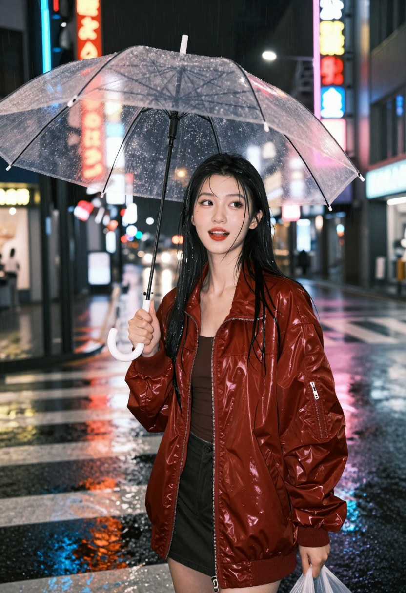

| 成立点 | 风格入口 | 成像系统 | 机位 | 主光 | 皮肤档 |
|---|---|---|---|---|---|
| 光线 + 成像方式 | 雨夜霓虹街拍 | 35mm 数码 | 路人视角的远距离抓拍 | 四面招牌霓虹 + 湿路面反射 | 纹理 |

`542 字 · 832x1216 · seed 6161 · 不挂 LoRA · 8 步 cfg 1.0`

```
9:16，35mm 数码摄影，雨夜霓虹街拍，湿反射，低饱和暗调，霓虹在湿路面上化开。
一位二十出头的亚洲年轻女性，窄长的鹅蛋小脸，清澈杏眼，眼线被雨气弄得有点晕，唇是水润的红色，自然半哑光底妆，保留真实的皮肤纹理。两边脸颊和鼻梁是和额头、下巴连续的同一片自然肤色，没有腮红。黑色的长直发被雨打湿了，几缕贴在脸颊和颈侧。
【穿搭】：她穿着一件深红色的尼龙教练夹克，拉链拉到一半，里面是一件深色的圆领上衣。
【场景】：城市的雨夜街口，路面积着水，四面的招牌都亮着，雨还在下但已经小了。
【道具元素】：一把透明的长柄伞 / 一只便利店塑料袋 / 斑马线 / 路边的一根信号灯杆（道具根据实际构图需求选取，不要将所有的道具全都塞进一个画面中）
【镜头角度】：路人视角的远距离抓拍，隔着一段马路，镜头没有被她注意到。
【构图】：人物在画面中心偏右、从膝盖往上，湿路面把上方的招牌整片反上来占掉画面下三分之一，浅景深。
【动作与表情】：她一手撑着透明伞、一手拎着塑料袋站在斑马线中间，忽然朝画外的什么人张嘴笑起来。
【光线与质感】：四面招牌的霓虹从各个方向落到她的伞面、肩线、湿掉的发梢和尼龙夹克的表面上，形成尼龙特有的成片反光和伞面的透光边缘；湿路面把霓虹整片反回来，成为画面下半部的主要亮源。
```
